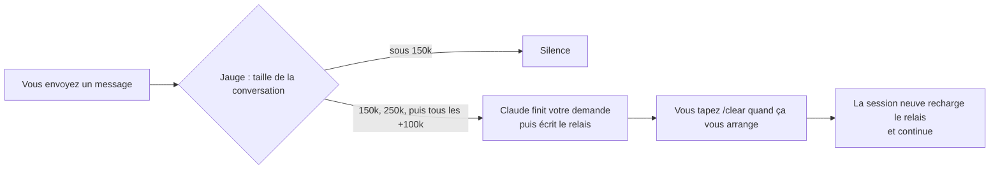

# Relais : arrêtez de payer Claude Code pour relire toute la conversation

*[English version](README.md)*

Sur les longues sessions Claude Code, **environ 97 % des tokens servent à relire l'historique de la
conversation**, pas à produire du travail. Relais passe la main à une session neuve et légère au bon
moment, avec un court résumé écrit : Claude continue sans traîner des centaines de milliers de tokens.
Sur les cinq plus grosses conversations réelles de l'auteur, c'est **-75 % de tokens** (simulation,
détails plus bas).

Pour tous ceux qui utilisent Claude Code sur de longues sessions, avec un forfait Pro/Max (vous
atteignez les limites plus tard) ou avec l'API (vous payez moins).

https://github.com/user-attachments/assets/10456c8c-69d7-4cb5-b3ef-fd7815e6c9b3

*Vidéo d'une minute : le problème, le relais, les économies. [La télécharger](docs/relais.mp4).*

https://github.com/user-attachments/assets/9057d2d0-0b03-4a59-b9e1-e00b9e9c2815

*Le reste de la boîte à outils en une minute : l'appli, le registre de règles, l'avocat du diable, les skills et les images. [La télécharger](docs/outils.mp4).*

---

## Installation

Choisissez **une** des deux façons. Les deux installent les mêmes plugins ; l'appli ajoute un tableau
de bord.

### Prérequis

| | Sert à |
|---|---|
| [Claude Code](https://docs.claude.com/fr/docs/claude-code), version récente, connecté (testé avec la 2.1.291) | tout |
| **Node.js 18 ou plus récent** dans le PATH (`node --version`) | les plugins : leurs hooks sont de petits scripts Node |
| Windows 10/11 x64 | l'appli Relais, et l'installation guidée du plugin `images` |
| Carte graphique NVIDIA (6 Go de VRAM conseillés), environ 15 Go libres | seulement le moteur gratuit d'`images` (sinon : Codex avec un forfait ChatGPT Plus ou Pro payant) |

Les plugins `relais` et `avocat` ont aussi du code pour macOS et Linux, mais ils n'ont été testés que
sous Windows pour l'instant. Les retours sont bienvenus.

> [!WARNING]
> **Sans Node.js 18+, les plugins s'installent mais ne font rien**, sans aucun message d'erreur : leurs
> hooks sont des scripts Node. Vérifiez avec `node --version` dans un terminal ; s'il est absent ou trop
> ancien, installez la version LTS depuis [nodejs.org](https://nodejs.org), puis rouvrez le terminal et
> Claude Code.

### A. L'appli Relais (Windows) : tableau de bord + plugins en un clic

1. Téléchargez **`Relais-Setup-<version>.exe`** dans la [dernière release](https://github.com/nathangerardeaux/claude-relais/releases/latest).
2. Lancez-le. L'appli n'est pas encore signée : Windows SmartScreen peut afficher un avertissement,
   cliquez sur **Informations complémentaires**, puis **Exécuter quand même**. L'installateur demande
   un dossier et propose un raccourci dans le menu Démarrer, un raccourci sur le Bureau et le
   lancement avec Windows (décoché par défaut).
3. Ouvrez **Relais**. Si Claude Code n'est pas connecté sur ce PC, l'appli vous demande d'abord
   `claude auth login`.
4. Dans l'onglet **Skills**, cliquez sur **Installer** pour `relais` (et pour `avocat` ou `images` si
   vous les voulez).
5. **Fermez et rouvrez Claude Code** (toutes les fenêtres ou sessions de terminal ouvertes). Les
   plugins n'agissent que dans les sessions ouvertes après l'installation. Pour avocat, tapez ensuite
   `/avocat on` ; pour images, tapez `/images:configurer`.

L'appli vérifie les mises à jour sur GitHub (10 s après le démarrage, puis toutes les 6 heures) et
**demande** avant de télécharger ou d'installer quoi que ce soit.

### B. Les plugins seuls (dans Claude Code, tout système)

Dans Claude Code :

```
/plugin marketplace add nathangerardeaux/claude-relais
/plugin install relais@claude-relais
```

En option, depuis le même marketplace : `/plugin install avocat@claude-relais` et
`/plugin install images@claude-relais`. Ensuite **fermez et rouvrez Claude Code** (les plugins
n'agissent que dans les sessions ouvertes après l'installation) et vérifiez avec `claude plugin list`.

Les mêmes commandes marchent dans un terminal : `claude plugin marketplace add nathangerardeaux/claude-relais`,
puis `claude plugin install relais@claude-relais`.

> **N'installez chaque plugin qu'une fois.** Le bouton Installer de l'appli copie le plugin dans
> `~/.claude/skills/` (il apparaît comme `relais@skills-dir`) ; le marketplace l'installe comme
> `relais@claude-relais`. Avec les deux, les hooks tournent deux fois.

**Disque externe ou réseau :** Claude Code refuse d'installer un marketplace depuis un emplacement
qu'il juge « network-shaped ». Utilisez l'appli, ou clonez le dépôt et lancez
`node plugins/relais/scripts/installer.mjs` (`--update` pour mettre à jour).

**Désinstaller :** `/plugin uninstall relais@claude-relais` (installation par le marketplace), ou
supprimez `~/.claude/skills/relais/` (installation par l'appli). L'onglet **Gestion des skills** peut
aussi désactiver un plugin. L'appli se désinstalle depuis les paramètres de Windows. Vos relais restent
dans `~/.claude/relais/`.

---

## Ce que vous obtenez

| | Ce que ça fait |
|---|---|
| Plugin **relais** | Mesure la taille de la conversation à chaque message. Au-delà de 150k tokens, Claude écrit un court relais (résumé) du travail ; vous tapez `/clear` et la nouvelle session repart de là. |
| **Registre de règles** (dans relais) | Claude note les pièges et les règles qu'il apprend (par projet ou global). Ils sont rechargés au début de chaque session : la même erreur n'est pas payée deux fois. `/regles` ouvre une conversation pour les revoir. |
| **Note de délégation** (dans relais) | Rappelle à Claude, une fois par session, de confier les longues tâches autonomes à un sous-agent moins cher (Sonnet ou Haiku) qui rend un résultat court. |
| **Appli Relais** (Windows) | Un tableau de bord de votre vraie consommation de tokens, conversation par conversation, et la gestion des plugins et skills en un clic. |
| Plugin **avocat** | Un interrupteur « avocat du diable » : tant qu'il est allumé, un agent indépendant en lecture seule essaie de réfuter chaque réponse avant que Claude conclue. |
| Plugin **images** | Génération d'images depuis Claude Code : gratuite avec un Stable Diffusion local (carte NVIDIA), ou Codex avec un forfait ChatGPT payant. Claude écrit le prompt, regarde le résultat et recommence si besoin. |

*« Relais » comme dans une course de relais : une session passe le témoin à la suivante.*

---

## Pourquoi Claude Code coûte si cher

Claude Code ne « se souvient » pas de la conversation : **à chaque action** (lire un fichier, lancer
une commande, modifier du code), il renvoie **toute** la conversation au modèle. Le cache rend cette
relecture moins chère, mais elle est comptée, des centaines de fois par jour.

| Taille de la conversation | Actions dans la journée | Tokens relus |
|---|---|---|
| 50k | 300 | 15 millions |
| 500k | 300 | **150 millions** |

Même travail, dix fois plus de tokens. Mesuré sur l'historique réel de l'auteur (3 semaines,
103 sessions) : **97 %** des tokens étaient des relectures d'historique, moins de 1 % du texte écrit
par le modèle, et la plus grosse conversation relisait en moyenne **508k tokens par action**, sur
10 016 actions.

---

## Comment marche relais



1. **La jauge** (à chaque message envoyé) lit la fin du journal local de la conversation et mesure ce
   que la dernière réponse a dû relire. Sous 150k : rien.
2. **Le relais.** À chaque seuil, Claude termine votre demande en cours, puis écrit (ou rafraîchit) un
   fichier de relais pour cette conversation : objectif, où on en est, décisions, prochaine étape
   exacte, pièges, 60 lignes au plus.
3. **Vous tapez `/clear`** quand vous voulez. Claude ne le fait jamais à votre place.
4. **Reprise automatique.** La nouvelle session recharge le relais toute seule (du code le vérifie
   d'abord : est-il frais, quels fichiers ont changé depuis, un chemin a-t-il disparu) et affiche une
   fois combien de tokens par action ont été libérés :

   > Bilan relais : avant 182k tokens relus à chaque action, maintenant 31k. Libérés : 151k par action (-83 %).

Vous préférez décider vous-même ? `RELAIS_AUTO=0` transforme le relais automatique en simples rappels,
et vous tapez `/relais` quand vous le voulez.

### Combien ça économise

Simulation sur les 5 plus grosses conversations réelles de l'auteur, avec un relais dès que la
conversation dépassait 150k (session neuve mesurée : environ 41k) :

| Conversation | Actions | Relu par action (moyenne) | Tokens relus : réel → avec relais | Économie |
|---|---|---|---|---|
| 1 | 28 308 | 521k | 14 756 M → 3 307 M | **-78 %** |
| 2 | 10 016 | 508k | 5 086 M → 1 066 M | **-79 %** |
| 3 | 4 667 | 507k | 2 367 M → 1 170 M | -51 % |
| 4 | 1 035 | 408k | 423 M → 107 M | -75 % |
| 5 | 724 | 556k | 402 M → 73 M | -82 % |
| **Total** | | | **23 034 M → 5 723 M** | **-75 %** |

La conversation 3 économise moins : de longues phases de travail autonome sans message de
l'utilisateur, et la jauge n'agit que quand vous écrivez. Mesurez vos propres chiffres (lecture seule) :

```
node plugins/relais/scripts/simuler-economie.mjs --top 5
```

Tous les détails (format du relais, règles de reprise, registre de règles, réglages) :
[plugins/relais/README.fr.md](plugins/relais/README.fr.md).

---

## L'appli Relais

Un tableau de bord local (appli Windows, ou `node tableau/serveur.mjs` / `lancer-tableau.cmd` dans un
navigateur, sur tout système avec Node) qui lit vos journaux Claude Code **sans jamais les modifier**.

| Onglet | Ce qu'on y voit et y fait |
|---|---|
| **Vue d'ensemble** | Tokens aujourd'hui / 7 jours / 30 jours, par jour et par projet, où ils partent (relus, écrits, générés), vos conversations les plus gourmandes, et des conseils calculés sur vos propres chiffres. |
| **Conversations** | Recherchez et ouvrez n'importe quelle conversation : courbe du contexte avec les seuils 150k / 250k, tokens ajoutés par chaque outil, sous-agents, modèles, et un tableau message par message. Un clic sur un message montre chaque appel au modèle qu'il a provoqué. Les chiffres sont en tokens, pas en argent. |
| **Skills** | Installez ou mettez à jour les plugins de ce dépôt en un clic, plus quelques skills externes choisis (Remotion avec une démo vidéo, skills de design et d'outils en ligne de commande), installés seulement après votre confirmation. |
| **Gestion des skills** | Chaque plugin installé avec son coût permanent en contexte. Activez-le ou désactivez-le partout ou **dans un seul projet**, et lancez Claude avec un profil choisi. |
| **Mémoire** | Le registre de règles : filtrer, ajouter, modifier, désactiver, supprimer. Voyez quels fichiers d'instructions Claude Code a vraiment chargés. Un chat « règles » (sans outil, sans accès aux fichiers) propose des modifications sous forme de cartes appliquées en un clic. |
| **Avocat du diable** | L'interrupteur de l'avocat. |
| **Paramètres** (appli) | Lancement avec Windows, version, mises à jour. |

Il ne s'ouvre que si Claude Code est connecté sur la machine (`claude auth status`), et affiche le nom
du compte et le forfait. En français ou en anglais, selon la langue du système.

---

## Confidentialité et réseau

| Partie | Réseau | Lit | Écrit |
|---|---|---|---|
| relais, avocat (scripts) | **aucun** (seulement des appels `git` locaux) | la fin de votre journal Claude Code | `~/.claude/relais/`, `~/.claude/avocat/` (sous `$CLAUDE_CONFIG_DIR` s'il est défini) |
| avocat (l'agent vérificateur) | peut faire des recherches web, comme tout agent Claude | vos fichiers, en lecture seule | rien |
| Tableau / appli | écoute sur **127.0.0.1 seulement** ; sorties seulement pour les mises à jour de l'appli (GitHub), les boutons que vous cliquez (installations, un fichier de design) et, seulement si vous avez accepté, les statistiques anonymes ci-dessous | vos journaux, en lecture seule ; **jamais un jeton de connexion** | un index local (`tableau/.cache/`, avec de courts extraits de messages), le registre, les réglages |
| Chat « règles » | envoie le registre à Claude via `claude -p`, sans outil | le registre | seulement les cartes que vous appliquez |
| images | téléchargements à l'installation (GitHub, Hugging Face, pip) ; Stable Diffusion tourne sur 127.0.0.1 ; **le moteur Codex envoie votre prompt à OpenAI** | | les images dans votre projet |

- **Statistiques d'usage anonymes (appli de bureau seulement, désactivées tant que vous n'avez pas dit
  oui).** À la première ouverture, l'appli pose la question une fois. Si vous acceptez, elle envoie un
  petit résumé quotidien à `api.nybo.fr` : temps avec la fenêtre au premier plan, nombre d'ouvertures de
  chaque onglet, plugins relais / avocat / images installés ou non (version, relais écrits sur 7 jours,
  avocat du diable activé ou non), versions de l'appli, de Windows, de Claude Code et de Node.js, et la
  langue, sous un identifiant aléatoire. Jamais d'e-mail, de nom, de chemin, de nom de projet ni de
  contenu de conversation. Vous pouvez la couper, voir le JSON exact ou supprimer vos données du serveur
  dans **Paramètres**. Les plugins eux-mêmes n'envoient rien. Format exact :
  [docs/statistiques.md](docs/statistiques.md).
- Un relais contient des informations sur votre projet (chemins, décisions). Il reste sur votre disque.
  Claude a pour consigne de n'y mettre **aucun secret**, et la reprise signale ce qui y ressemble ;
  relisez-le si votre projet est sensible.
- En cas d'erreur, les hooks se taisent : ils ne bloquent **jamais** un message ni une session.

---

## Réglages

Variables d'environnement facultatives, par exemple dans le bloc `env` de `~/.claude/settings.json` :

| Variable | Défaut | Rôle |
|---|---|---|
| `RELAIS_SEUIL_K` | `150` | Premier seuil, en milliers de tokens |
| `RELAIS_SEUIL_FORT_K` | `250` | Seuil insistant |
| `RELAIS_AUTO` | actif | `0` = simples rappels, vous tapez `/relais` vous-même |
| `RELAIS_MEMOIRE` | actif | `0` = ne pas recharger le registre de règles au début des sessions |
| `RELAIS_DELEGUER` | actif | `0` = pas de note de délégation |
| `RELAIS_LANG` | système | `en` ou `fr` |
| `AVOCAT_MIN_CAR` | `200` | avocat : les réponses plus courtes et sans action ne sont pas vérifiées |

**Quel seuil ?** Sur les conversations mesurées : 100k = -83 %, 150k = -79 %, 250k = -71 %. Plus bas
économise plus, mais passe la main plus souvent.

---

## Dépannage

- **Aucun rappel ne s'affiche.** Vérifiez `claude plugin list` et que la session a été ouverte après
  l'installation. Sous 150k, le silence est normal. Certaines extensions d'éditeur n'affichent pas les
  messages des hooks : Claude reçoit quand même la note.
- **`node` introuvable.** Installez Node.js 18+ et ouvrez un nouveau terminal.
- **Rappels ou relais en double.** Le plugin est installé deux fois (appli + marketplace) : gardez-en
  un.
- **Le relais n'est pas rechargé après `/clear`.** Il n'est rechargé que si Claude l'a écrit ou
  rafraîchi peu avant ; sinon il est seulement annoncé. Dites « reprends le relais » pour le charger.
- **Erreur « network-shaped ».** Voir la note sur les disques externes dans [Installation](#installation).
- **Déboguer les hooks :** `claude --debug`, ou `/debug` pendant une session.

## Limites

- relais ne vide jamais la conversation à votre place : l'économie dépend de votre `/clear` quand le
  relais est prêt.
- Pendant une longue phase autonome sans message de votre part, la jauge ne se déclenche pas.
- Le résumé est écrit par le modèle : relisez le relais pour les tâches critiques.
- Les économies ci-dessus sont des simulations sur un historique réel, pas une garantie.

---

## Tests et licence

Chaque suite tourne dans un dossier temporaire, jamais dans votre vrai `~/.claude` :

```
node plugins/relais/scripts/tester.mjs                 # 165 tests
node plugins/avocat/scripts/tester.mjs                 # 17 tests
node plugins/images/scripts/tester.mjs                 # 74 tests
node plugins/images/scripts/tester-installation.mjs    # 106 tests
node tableau/tester.mjs                                # 190 tests
```

Les vidéos sont faites avec Remotion : source dans [video/](video/).

Licence : GPL-3.0 ou version ultérieure (voir [LICENSE](LICENSE)). Copyright (C) 2026 nathangerardeaux.
Les versions publiées avant ce changement (relais 2.1.0 et antérieures) restent disponibles sous
licence MIT.
