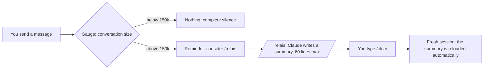

# relais — stop paying for Claude Code to re-read your conversations

*[Version française](README.fr.md)*

**relais** is a Claude Code plugin that sharply cuts token usage without changing how you work. It
watches the size of the conversation, warns you at the right moment, has Claude write a short
handoff of what was done, then starts a light session that picks up from that handoff by itself.

- 100% local: no network access, nothing sent anywhere.
- 4 small readable scripts, no dependency to install.
- Messages in English or French (follows the system language).
- Windows, macOS and Linux.

*"Relais" is French for "relay", as in a relay race: one session hands the baton to the next.*

---

## Contents

1. [The problem: why Claude Code gets so expensive](#1-the-problem-why-claude-code-gets-so-expensive)
2. [What relais does](#2-what-relais-does)
3. [How much it saves](#3-how-much-it-saves)
4. [Installation](#4-installation)
5. [Day-to-day use](#5-day-to-day-use)
6. [The relay file](#6-the-relay-file)
7. [Settings](#7-settings)
8. [Measure your own savings](#8-measure-your-own-savings)
9. [Privacy and security](#9-privacy-and-security)
10. [relais, /compact or /clear?](#10-relais-compact-or-clear)
11. [Troubleshooting](#11-troubleshooting)
12. [Limits](#12-limits)
13. [Tests and license](#13-tests-and-license)

---

## 1. The problem: why Claude Code gets so expensive

Claude Code does not "remember" the conversation: **on every action** (reading a file, running a
command, editing code) it sends the **whole** conversation from the start back to the model. Caching
makes that re-read cheaper, but it is still billed, and it happens hundreds of times.

A simple calculation:

| Conversation size | Actions in a day | Tokens re-read |
|---|---|---|
| 50k | 300 | 15 million |
| 500k | 300 | **150 million** |

Same work, ten times the tokens, only because the conversation was never restarted. With
one-million-token context windows, a conversation can keep growing for days before Claude Code
summarizes it on its own.

**Real measurement** (the author's own history, 3 weeks, 103 sessions):

- **97%** of the tokens consumed were **history re-reads**;
- less than 1% was text actually written by the model;
- the biggest conversation re-read **508k tokens per action** on average, over 10,016 actions.

You are barely paying for the work produced: you are mostly paying for re-reading a huge history,
again and again.

---

## 2. What relais does



**1. The gauge** (on every message you send)
It reads the end of the local conversation log and measures how many tokens the last response had to
re-read. Below 150k: nothing. Above: an on-screen reminder, plus a short note for Claude, which will
suggest `/relais` at the right time (at the end of a step, not in the middle). One reminder per
threshold (150k, 250k, then every +100k), never on every message. It reads a 200 MB log in under
0.2 seconds.

**2. The `/relais` command**
Claude first updates the project's durable notes if something must survive (CLAUDE.md, a memory
folder, documentation), then writes a summary of 60 lines max: goal, where things stand, decisions
made, files touched, the exact next step, pitfalls. It then tells you to type `/clear`.

**3. Automatic resume**
After `/clear`, the new session reloads that summary by itself. It starts with your usual
instructions plus a few thousand tokens of summary, instead of hundreds of thousands of history. The
summary is used **only once** (then archived). If you open a new tab instead, the relay is only
**announced**: say "resume the relay" to load it.

---

## 3. How much it saves

Simulation on the author's 5 biggest real conversations, relaying every time the conversation was
above 150k when a message was sent (measured fresh session: ~41k):

| Conversation | Actions | Re-read per action (average) | Re-read tokens: real → with relais | Saving |
|---|---|---|---|---|
| 1 | 28,308 | 521k | 14,756 M → 3,307 M | **-78%** |
| 2 | 10,016 | 508k | 5,086 M → 1,066 M | **-79%** |
| 3 | 4,667 | 507k | 2,367 M → 1,170 M | -51% |
| 4 | 1,035 | 408k | 423 M → 107 M | -75% |
| 5 | 724 | 556k | 402 M → 73 M | -82% |
| **Total** | | | **23,034 M → 5,723 M** | **-75%** |

Conversation 3 saves less because it contains long stretches of autonomous work with no message from
the user: a relay can only happen when you write.

The plugin itself costs about **140 tokens per session**, and about 1,000 when you run `/relais`.

Measure your own numbers with the simulator: [section 8](#8-measure-your-own-savings).

---

## 4. Installation

### Requirements

- Claude Code with plugin support (the `/plugin` command).
- **Node.js 18 or newer** on the PATH (`node --version`). The hooks are small Node scripts.

### Install from GitHub (recommended)

In Claude Code:

```
/plugin marketplace add nathangerardeaux/claude-relais
/plugin install relais@claude-relais
```

Or from a terminal:

```
claude plugin marketplace add nathangerardeaux/claude-relais
claude plugin install relais@claude-relais
```

Then **restart Claude Code** (the plugin only acts in sessions opened after installation). Check:

```
claude plugin list
```

`relais` should show up as loaded.

### Fallback install (external or network drive)

Claude Code refuses to install a plugin from a location it considers "network-shaped" (for example an
external drive on Windows). In that case, copy the plugin into your home folder, where Claude Code
loads it by itself:

```
node plugins/relais/scripts/installer.mjs
```

It will show up as `relais@skills-dir`. To update: same command with `--update`.

**Do not install both** (marketplace AND fallback): the hooks would run twice.

### Uninstall

- GitHub install: `/plugin uninstall relais@claude-relais`
- Fallback install: delete the `~/.claude/skills/relais/` folder

Your written relays stay in `~/.claude/relais/`: delete that folder if you no longer want them.

---

## 5. Day-to-day use

Work as usual. As long as the conversation stays light, relais says nothing.

**When the conversation goes above 150k**, you see:

> Relay: this conversation is 180k tokens, re-read on every action. Consider /relais once the current
> step is done.

Claude finishes what it is doing, then suggests the relay in one line. Nothing happens without you.

**Above 250k**, the reminder becomes more insistent.

**To hand over:**

1. type `/relais`;
2. Claude writes the summary and confirms: "Relay written: … Type /clear";
3. type `/clear`;
4. the session restarts with "Relay resumed: …", and Claude carries on with the next step.

**The right reflex**: hand over **between two steps** (a finished feature, a fixed bug, a change of
topic), not in the middle of an edit.

**Switching topics**: if you move on to something completely different, a plain `/clear` is enough,
no relay needed.

---

## 6. The relay file

Location: `~/.claude/relais/` (on Windows: `%USERPROFILE%\.claude\relais\`), one file per relay, for
example `2026-09-30_14h05_mobile-menu.md`.

```markdown
---
title: Mobile menu that does not scroll
cwd: /home/me/projects/site
date: 2026-09-30 14:05
---

## Goal
Make the site menu scroll on phones instead of moving the page behind it.

## Where we are
- Done: CSS fix, checked on 5 screen sizes.
- In progress: nothing.

## Decisions made
- The submenu joins the mobile menu from 900 px (validated).

## Files touched
- `src/index.css`: bounded height + inner scrolling (committed, not deployed yet)

## Next step
Build the site, then deploy it.

## Pitfalls and watch-outs
- Deployment waits for the go-ahead.
```

- The `cwd:` line ties the relay to its project folder: a session opened in another project will
  never load it.
- A relay is reloaded automatically only if it is less than **72 h** old (after `/clear`), or
  announced if less than **12 h** old (new tab).
- After use it is renamed `.repris.md`: you keep a history of your relays.
- It is a plain text file: you can read or correct it before typing `/clear`.

---

## 7. Settings

Three optional environment variables:

| Variable | Default | Purpose |
|---|---|---|
| `RELAIS_SEUIL_K` | `150` | First reminder, in thousands of tokens |
| `RELAIS_SEUIL_FORT_K` | `250` | Insistent reminder |
| `RELAIS_LANG` | from the system | `en` or `fr` |

The easiest place is the `env` block of `~/.claude/settings.json`:

```json
{
  "env": {
    "RELAIS_SEUIL_K": "120",
    "RELAIS_LANG": "en"
  }
}
```

**Which threshold?** On the measured conversations: 100k = -83%, 150k = -79%, 250k = -71%. The lower
the threshold, the more you save, but the more often you hand over. 150k is a good balance.

---

## 8. Measure your own savings

The simulator replays your real past conversations (read-only, nothing is modified):

```
node plugins/relais/scripts/simuler-economie.mjs --top 5
```

It finds your 5 heaviest conversations in `~/.claude/projects/`, measures what a fresh session costs
you, and prints the saving the relay would have given. For one specific conversation, with another
threshold:

```
node plugins/relais/scripts/simuler-economie.mjs <log.jsonl> 120
```

To see your real usage in dollars: [ccusage](https://github.com/ryoppippi/ccusage)
(`npx ccusage@latest claude daily`).

---

## 9. Privacy and security

- **No network access.** None of the scripts opens a connection or sends anything.
- **What is read**: the end of the conversation log Claude Code already keeps on your disk
  (`~/.claude/projects/…`), only to read the token counter of the last response.
- **What is written**: relay files in `~/.claude/relais/`, and one tiny state file per session in
  `~/.claude/relais/.etat/` (deleted after 7 days). Nothing else.
- **What is added to Claude's context**: a one-line note when a threshold is crossed, and the content
  of a relay when you resume it.
- A relay contains information about your project (paths, decisions). It stays on your machine.
  Claude is instructed to put **no secrets** in it (password, token, key), but re-read it if your
  project is sensitive.
- On any error, the hooks stay silent: they **never** block a message or a session.
- The code is four short files in `scripts/`: read them before installing.

---

## 10. relais, /compact or /clear?

| | `/clear` alone | `/compact` | **relais** |
|---|---|---|---|
| Starting size afterwards | minimal | reduced, but the conversation keeps growing | minimal + summary |
| Keeps the thread of the work | no | yes, automatic summary | yes, structured summary |
| Warns you at the right time | no | no (automatic only near the window limit) | **yes, from 150k** |
| Updates durable notes | no | no | yes, before the summary |
| Readable, editable trace | no | no | yes, one file per relay |

`/compact` is still useful in the middle of a long task. relais is mostly about **never letting a
conversation grow unnoticed again**, which is where the bill really comes from.

---

## 11. Troubleshooting

**I never see a reminder.**
Check `claude plugin list` (relais loaded?) and that the session was opened **after** installing.
While the conversation stays under 150k, silence is normal. Some interfaces (editor extensions,
third-party apps) do not display hook messages: Claude still receives the note and will suggest
`/relais` itself.

**`node` not found.**
Install Node.js 18+ and check that `node --version` works in a new terminal.

**`network-shaped` error when installing.**
The plugin sits on an external or network drive: use the fallback install (section 4).

**Reminders show up twice.**
The plugin is installed twice (marketplace and fallback). Keep only one.

**The relay is not reloaded after /clear.**
Check that the file exists in `~/.claude/relais/`, that it is less than 72 h old, and that its `cwd:`
line matches the session's folder. If it was already used, it has the `.repris.md` suffix.

**Debugging the hooks**: run `claude --debug`, or `/debug` during a session.

---

## 12. Limits

- relais **does not hand over for you**: that is deliberate, you stay in control. The saving depends
  on your reflex to type `/relais` when it is suggested.
- During a long autonomous run with no message from you, the gauge does not fire (it acts when you
  write).
- Summary quality depends on the model. The imposed format (60 lines, exact next step) limits losses,
  but a detail can slip: re-read the relay for critical tasks.
- The savings in section 3 are **simulations** on a real history, not a guarantee.

---

## 13. Tests and license

```
node plugins/relais/scripts/tester.mjs
```

17 tests in a temporary folder (never your real `~/.claude`): gauge, thresholds, no repeated
reminders, invalid input, resume, single use, other project, age limit, English and French messages,
and fast reading of a 60 MB log.

MIT license.
