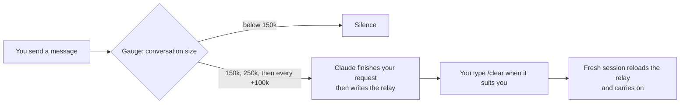

# Relais: stop paying Claude Code to re-read your whole conversation

*[Version française](README.fr.md)*

On long Claude Code sessions, **about 97% of the tokens go into re-reading the conversation history**,
not into new work. Relais hands the work over to a fresh, light session at the right moment, with a
short written summary, so Claude carries on without dragging hundreds of thousands of tokens along.
On the author's five biggest real conversations, that is **-75% tokens** (simulation, details below).

For anyone who uses Claude Code for long sessions, on a Pro/Max plan (you hit the limits later) or on
the API (you pay less).

https://github.com/user-attachments/assets/10456c8c-69d7-4cb5-b3ef-fd7815e6c9b3

*One-minute video (French voice-over): the problem, the relay, the savings. [Download it](docs/relais.mp4).*

https://github.com/user-attachments/assets/9057d2d0-0b03-4a59-b9e1-e00b9e9c2815

*The rest of the toolbox in one minute (French voice-over): the app, the rules registry, the devil's advocate, the skills and the images. [Download it](docs/outils.mp4).*

---

## Install

Pick **one** of the two ways. Both install the same plugins; the app adds a dashboard on top.

### Requirements

| | Needed for |
|---|---|
| [Claude Code](https://docs.claude.com/en/docs/claude-code), recent version, signed in (tested with 2.1.291) | everything |
| **Node.js 18 or newer** on the PATH (`node --version`) | the plugins: their hooks are small Node scripts |
| Windows 10/11 x64 | the Relais app, and the guided setup of the `images` plugin |
| NVIDIA graphics card (6 GB VRAM advised), about 15 GB free | the free engine of `images` only (otherwise: Codex with a paid ChatGPT Plus or Pro plan) |

The plugins `relais` and `avocat` also contain macOS and Linux code paths, but they have only been
tested on Windows so far. Feedback welcome.

> [!WARNING]
> **Without Node.js 18+, the plugins install fine but do nothing**, with no error message: their hooks
> are Node scripts. Check with `node --version` in a terminal; if it is missing or older, install the
> LTS version from [nodejs.org](https://nodejs.org), then reopen your terminal and Claude Code.

### A. The Relais app (Windows): dashboard + one-click plugins

1. Download **`Relais-Setup-<version>.exe`** from the [latest release](https://github.com/nathangerardeaux/claude-relais/releases/latest).
2. Run it. The app is not code-signed yet, so Windows SmartScreen may warn you: click
   **More info**, then **Run anyway**. The installer asks for a folder and offers a Start menu
   shortcut, a desktop shortcut and starting with Windows (unticked by default).
3. Open **Relais**. If Claude Code is not signed in on this PC, the app tells you to run
   `claude auth login` first.
4. In the **Skills** tab, click **Install** on `relais` (and on `avocat` or `images` if you want them).
5. **Close and reopen Claude Code** (every open window or terminal session). Plugins only act in
   sessions opened after they were installed. For avocat, then type `/avocat on`; for images, type
   `/images:configurer`.

The app checks GitHub for updates (10 s after start, then every 6 hours) and **asks** before
downloading or installing anything.

### B. Plugins only (in Claude Code, any OS)

In Claude Code:

```
/plugin marketplace add nathangerardeaux/claude-relais
/plugin install relais@claude-relais
```

Optional extras from the same marketplace: `/plugin install avocat@claude-relais` and
`/plugin install images@claude-relais`. Then **close and reopen Claude Code** (plugins only act in
sessions opened after the install) and check with `claude plugin list`.

The same commands work from a terminal: `claude plugin marketplace add nathangerardeaux/claude-relais`,
then `claude plugin install relais@claude-relais`.

> **Install each plugin only once.** The app's Install button copies the plugin into
> `~/.claude/skills/` (it shows up as `relais@skills-dir`); the marketplace installs it as
> `relais@claude-relais`. With both, the hooks run twice.

**External or network drive:** Claude Code refuses to install a marketplace from a location it
considers "network-shaped". Use the app, or clone the repo and run
`node plugins/relais/scripts/installer.mjs` (add `--update` to update).

**Uninstall:** `/plugin uninstall relais@claude-relais` (marketplace install), or delete
`~/.claude/skills/relais/` (app install). The **Manage skills** tab can also turn a plugin off. The app
itself uninstalls from Windows settings.
Your relays stay in `~/.claude/relais/`.

---

## What you get

| | What it does |
|---|---|
| **relais** plugin | Measures the conversation size on every message. Above 150k tokens, Claude writes a short relay (summary) of the work; you type `/clear` and the new session resumes from it. |
| **Rules registry** (in relais) | Claude records the pitfalls and rules it learns (per project or global). They are reloaded at the start of every session, so the same mistake is not paid for twice. `/regles` opens a conversation to review them. |
| **Delegation note** (in relais) | Reminds Claude once per session to give long, self-contained tasks to a cheaper subagent (Sonnet or Haiku) that returns a short result. |
| **Relais app** (Windows) | A dashboard of your real token usage, conversation by conversation, and one-click management of plugins and skills. |
| **avocat** plugin | A "devil's advocate" switch: while on, an independent read-only agent tries to refute every answer before Claude concludes. |
| **images** plugin | Image generation from Claude Code: free with a local Stable Diffusion (NVIDIA GPU), or Codex with a paid ChatGPT plan. Claude writes the prompt, looks at the result and retries. |

*"Relais" is French for "relay", as in a relay race: one session hands the baton to the next.*

---

## Why Claude Code gets expensive

Claude Code does not "remember" the conversation: **on every action** (reading a file, running a
command, editing code) it sends the **whole** conversation back to the model. Caching makes that
re-read cheaper, but it is still counted, hundreds of times a day.

| Conversation size | Actions in a day | Tokens re-read |
|---|---|---|
| 50k | 300 | 15 million |
| 500k | 300 | **150 million** |

Same work, ten times the tokens. Measured on the author's own history (3 weeks, 103 sessions):
**97%** of the tokens were history re-reads, less than 1% was text written by the model, and the
biggest conversation re-read **508k tokens per action** on average, over 10,016 actions.

---

## How relais works



1. **The gauge** (on every message you send) reads the end of the local conversation log and measures
   what the last answer had to re-read. Below 150k: nothing.
2. **The relay.** At each threshold, Claude finishes your current request, then writes (or refreshes)
   one relay file for this conversation: goal, where things stand, decisions, the exact next step,
   pitfalls, at most 60 lines.
3. **You type `/clear`** whenever you want. Claude never does it for you.
4. **Automatic resume.** The new session reloads the relay by itself (code checks it first: is it
   fresh, which files changed since, did a path disappear) and shows once how many tokens per action
   were freed:

   > Relay tally: before 182k tokens re-read on every action, now 31k. Freed: 151k per action (-83%).

Prefer to decide yourself? `RELAIS_AUTO=0` turns the automatic relay into simple reminders, and you
type `/relais` when you want one.

### How much it saves

Simulation on the author's 5 biggest real conversations, relaying whenever the conversation was above
150k (measured fresh session: about 41k):

| Conversation | Actions | Re-read per action (average) | Re-read tokens: real → with relais | Saving |
|---|---|---|---|---|
| 1 | 28,308 | 521k | 14,756 M → 3,307 M | **-78%** |
| 2 | 10,016 | 508k | 5,086 M → 1,066 M | **-79%** |
| 3 | 4,667 | 507k | 2,367 M → 1,170 M | -51% |
| 4 | 1,035 | 408k | 423 M → 107 M | -75% |
| 5 | 724 | 556k | 402 M → 73 M | -82% |
| **Total** | | | **23,034 M → 5,723 M** | **-75%** |

Conversation 3 saves less: long stretches of autonomous work with no message from the user, and the
gauge only acts when you write. Measure your own numbers (read-only):

```
node plugins/relais/scripts/simuler-economie.mjs --top 5
```

Full details (relay format, resume rules, rules registry, all settings):
[plugins/relais/README.md](plugins/relais/README.md).

---

## The Relais app

A local dashboard (Windows app, or `node tableau/serveur.mjs` / `lancer-tableau.cmd` in a browser,
any OS with Node) that reads your Claude Code logs **without ever changing them**.

| Tab | What you see and do |
|---|---|
| **Overview** | Tokens today / 7 days / 30 days, per day and per project, where they go (re-read, written, generated), your heaviest conversations, and tips computed from your own numbers. |
| **Conversations** | Search and open any conversation: context curve with the 150k / 250k thresholds, tokens added by each tool, subagents, models, and a message-by-message table. Click a message to see every model call it caused. Figures are in tokens, not money. |
| **Skills** | Install or update this repo's plugins in one click, plus a few hand-picked external skills (Remotion with a video demo, design and CLI skills) installed only after you confirm. |
| **Manage skills** | Every installed plugin with its permanent context cost. Turn each one on or off everywhere or **only in one project**, and launch Claude with a chosen profile. |
| **Memory** | The rules registry: filter, add, edit, turn off, delete. See which instruction files Claude Code really loaded. A "rules" chat (no tools, no file access) proposes changes as cards you apply with one click. |
| **Devil's advocate** | The avocat on/off switch. |
| **Settings** (app) | Start with Windows, version, updates. |

It opens only when Claude Code is signed in on the machine (`claude auth status`), and shows the
account name and plan. French or English, following the system language.

---

## Privacy and network

| Part | Network | Reads | Writes |
|---|---|---|---|
| relais, avocat (scripts) | **none** (only local `git` calls) | the end of your Claude Code log | `~/.claude/relais/`, `~/.claude/avocat/` (under `$CLAUDE_CONFIG_DIR` when set) |
| avocat (the checking agent) | it may use web search, like any Claude agent | your files, read-only | nothing |
| Dashboard / app | listens on **127.0.0.1 only**; outgoing only for app updates (GitHub), buttons you click (installs, one design file) and, only if you opted in, the anonymous statistics below | your logs, read-only; **never a login token** | a local index (`tableau/.cache/`, with short message excerpts), the registry, settings |
| "Rules" chat | sends the registry to Claude through `claude -p`, no tools | the registry | only the cards you apply |
| images | downloads at setup (GitHub, Hugging Face, pip); Stable Diffusion runs on 127.0.0.1; **the Codex engine sends your prompt to OpenAI** | | images in your project |

- **Anonymous usage statistics (desktop app only, off until you say yes).** The first time the app opens,
  it asks once. If you accept, it sends a small daily summary to `api.nybo.fr`: time with the window in
  the foreground, how many times each tab was opened, whether the relais / avocat / images plugins are
  installed (version, relays written over 7 days, devil's advocate on or off), the app, Windows, Claude
  Code and Node.js versions, and the language, under a random identifier. Never an e-mail, a name, a
  path, a project name or any conversation content. You can switch it off, preview the exact JSON, or
  delete your data from the server in **Settings**. The plugins themselves never send anything. Exact
  format: [docs/statistiques.md](docs/statistiques.md).
- A relay contains information about your project (paths, decisions). It stays on your disk. Claude is
  told to put **no secrets** in it, and resume flags anything that looks like one; re-read it if your
  project is sensitive.
- On any error the hooks stay silent: they **never** block a message or a session.

---

## Settings

Optional environment variables, for example in the `env` block of `~/.claude/settings.json`:

| Variable | Default | Purpose |
|---|---|---|
| `RELAIS_SEUIL_K` | `150` | First threshold, in thousands of tokens |
| `RELAIS_SEUIL_FORT_K` | `250` | Insistent threshold |
| `RELAIS_AUTO` | on | `0` = simple reminders, you type `/relais` yourself |
| `RELAIS_MEMOIRE` | on | `0` = do not reload the rules registry at session start |
| `RELAIS_DELEGUER` | on | `0` = no delegation note |
| `RELAIS_LANG` | system | `en` or `fr` |
| `AVOCAT_MIN_CAR` | `200` | avocat: shorter answers with no action are not checked |

**Which threshold?** On the measured conversations: 100k = -83%, 150k = -79%, 250k = -71%. Lower saves
more but hands over more often.

---

## Troubleshooting

- **No reminder ever shows.** Check `claude plugin list` and that the session was opened after the
  install. Below 150k, silence is normal. Some editor extensions do not display hook messages: Claude
  still gets the note.
- **`node` not found.** Install Node.js 18+ and open a new terminal.
- **Reminders or relays appear twice.** The plugin is installed twice (app + marketplace): keep one.
- **The relay is not reloaded after `/clear`.** It is reloaded only if Claude wrote or refreshed it
  shortly before; otherwise it is only announced. Say "resume the relay" to load it.
- **"network-shaped" error.** See the external drive note in [Install](#install).
- **Debug the hooks:** `claude --debug`, or `/debug` during a session.

## Limits

- relais never clears the conversation for you: the saving depends on you typing `/clear` when the
  relay is ready.
- During a long autonomous run with no message from you, the gauge does not fire.
- The summary is written by the model: re-read the relay for critical tasks.
- The savings above are simulations on a real history, not a guarantee.

---

## Tests and license

Each suite runs in a temporary folder, never in your real `~/.claude`:

```
node plugins/relais/scripts/tester.mjs                 # 165 tests
node plugins/avocat/scripts/tester.mjs                 # 17 tests
node plugins/images/scripts/tester.mjs                 # 74 tests
node plugins/images/scripts/tester-installation.mjs    # 106 tests
node tableau/tester.mjs                                # 190 tests
```

The videos are made with Remotion: source in [video/](video/).

License: GPL-3.0-or-later (see [LICENSE](LICENSE)). Copyright (C) 2026 nathangerardeaux.
Versions published before this change (relais 2.1.0 and earlier) remain available under the MIT license.
