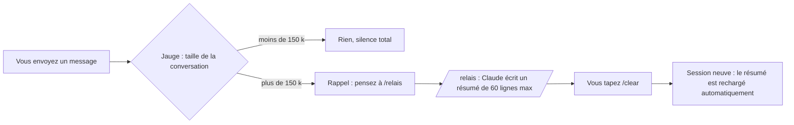

# relais — arrêter de payer la relecture de vos conversations Claude Code

*[English version](README.md)*

**relais** est un plugin pour Claude Code qui fait baisser fortement la consommation de tokens, sans
changer votre façon de travailler. Il surveille la taille de la conversation, vous prévient au bon
moment, fait écrire un résumé court de ce qui a été fait, puis relance une session légère qui repart
de ce résumé toute seule.

- 100 % local : aucun accès réseau, aucune donnée envoyée nulle part.
- 4 petits scripts lisibles, aucune dépendance à installer.
- Messages en français ou en anglais (selon la langue du système).
- Windows, macOS et Linux.

---

## Sommaire

1. [Le problème : pourquoi Claude Code coûte si cher](#1-le-problème--pourquoi-claude-code-coûte-si-cher)
2. [Ce que fait relais](#2-ce-que-fait-relais)
3. [Ce que ça fait économiser](#3-ce-que-ça-fait-économiser)
4. [Installation](#4-installation)
5. [Utilisation au quotidien](#5-utilisation-au-quotidien)
6. [Le fichier de relais](#6-le-fichier-de-relais)
7. [Réglages](#7-réglages)
8. [Mesurer vos propres économies](#8-mesurer-vos-propres-économies)
9. [Confidentialité et sécurité](#9-confidentialité-et-sécurité)
10. [relais, /compact ou /clear ?](#10-relais-compact-ou-clear-)
11. [Dépannage](#11-dépannage)
12. [Limites](#12-limites)
13. [Tests et licence](#13-tests-et-licence)

---

## 1. Le problème : pourquoi Claude Code coûte si cher

Claude Code ne « se souvient » pas de la conversation : **à chaque action** (lire un fichier, lancer
une commande, éditer du code), il renvoie au modèle **toute** la conversation depuis le début. Le cache
rend cette relecture moins chère, mais elle reste facturée, et elle se répète des centaines de fois.

Un calcul simple :

| Taille de la conversation | Actions dans la journée | Tokens relus |
|---|---|---|
| 50 k | 300 | 15 millions |
| 500 k | 300 | **150 millions** |

Même travail, dix fois plus de tokens, uniquement parce que la conversation n'a jamais été
redémarrée. Avec les fenêtres de contexte d'un million de tokens, une conversation peut grossir
pendant des jours avant que Claude Code ne la résume de lui-même.

**Mesure réelle** (historique de l'auteur, 3 semaines, 103 sessions) :

- **97 %** des tokens consommés étaient de la **relecture d'historique** ;
- moins de 1 % était du texte réellement écrit par le modèle ;
- la plus grosse conversation relisait en moyenne **508 k tokens par action**, sur 10 016 actions.

On ne paie donc presque pas le travail produit : on paie surtout la relecture, encore et encore,
d'un historique géant.

---

## 2. Ce que fait relais



**1. La jauge** (à chaque message que vous envoyez)
Elle lit la fin du journal local de la conversation et mesure combien de tokens la dernière réponse a
dû relire. Sous 150 k : rien. Au-delà : un rappel à l'écran, et une courte note pour Claude, qui vous
proposera `/relais` au bon moment (à la fin d'une étape, pas au milieu). Un seul rappel par palier
(150 k, 250 k, puis tous les +100 k), jamais à chaque message. Elle lit un journal de 200 Mo en
moins de 0,2 seconde.

**2. La commande `/relais`**
Claude met d'abord à jour les notes durables du projet si quelque chose doit survivre (CLAUDE.md,
dossier de mémoire, documentation), puis écrit un résumé de 60 lignes maximum : objectif, où on en
est, décisions prises, fichiers touchés, prochaine étape exacte, pièges. Il vous dit ensuite de taper
`/clear`.

**3. La reprise automatique**
Après `/clear`, la nouvelle session recharge ce résumé toute seule. Elle démarre avec vos consignes
habituelles plus quelques milliers de tokens de résumé, au lieu de plusieurs centaines de milliers
d'historique. Le résumé n'est utilisé **qu'une fois** (puis archivé). Si vous ouvrez un nouvel onglet
à la place, le relais est seulement **signalé** : dites « reprends le relais » pour le charger.

---

## 3. Ce que ça fait économiser

Simulation sur les 5 plus grosses conversations réelles de l'auteur, avec un relais à chaque fois
que la conversation dépassait 150 k au moment d'un message (session neuve mesurée : ~41 k) :

| Conversation | Actions | Relu par action (moyenne) | Tokens relus : réel → avec relais | Économie |
|---|---|---|---|---|
| 1 | 28 308 | 521 k | 14 756 M → 3 307 M | **-78 %** |
| 2 | 10 016 | 508 k | 5 086 M → 1 066 M | **-79 %** |
| 3 | 4 667 | 507 k | 2 367 M → 1 170 M | -51 % |
| 4 | 1 035 | 408 k | 423 M → 107 M | -75 % |
| 5 | 724 | 556 k | 402 M → 73 M | -82 % |
| **Total** | | | **23 034 M → 5 723 M** | **-75 %** |

La conversation 3 gagne moins parce qu'elle contient de longues phases de travail autonome sans
message de l'utilisateur : le relais ne peut se faire qu'au moment où vous écrivez.

Le plugin lui-même coûte environ **140 tokens par session**, et environ 1 000 quand vous lancez
`/relais`.

Mesurez vos propres chiffres avec le simulateur : [section 8](#8-mesurer-vos-propres-économies).

---

## 4. Installation

### Prérequis

- Claude Code avec la prise en charge des plugins (commande `/plugin`).
- **Node.js 18 ou plus récent** dans le PATH (`node --version`). Les hooks sont de petits scripts Node.

### Installation depuis GitHub (recommandée)

Dans Claude Code :

```
/plugin marketplace add nathangerardeaux/claude-relais
/plugin install relais@claude-relais
```

Ou depuis un terminal :

```
claude plugin marketplace add nathangerardeaux/claude-relais
claude plugin install relais@claude-relais
```

Puis **redémarrez Claude Code** (le plugin n'agit que dans les sessions ouvertes après
l'installation). Vérification :

```
claude plugin list
```

`relais` doit apparaître avec le statut chargé.

### Installation de secours (disque externe ou réseau)

Claude Code refuse d'installer un plugin situé sur un emplacement qu'il considère comme « réseau »
(par exemple un disque externe sous Windows) : erreur `network-shaped`. Dans ce cas, copiez le plugin
dans votre dossier personnel, où Claude Code le charge tout seul :

```
node <chemin-du-plugin>/scripts/installer.mjs
```

Il apparaîtra comme `relais@skills-dir`. Mise à jour : même commande avec `--update`.

**N'installez pas les deux à la fois** (marketplace ET secours) : les hooks s'exécuteraient deux fois.

### Désinstaller

- Installation GitHub : `/plugin uninstall relais@claude-relais`
- Installation de secours : supprimez le dossier `~/.claude/skills/relais/`

Vos relais écrits restent dans `~/.claude/relais/` : supprimez ce dossier si vous n'en voulez plus.

---

## 5. Utilisation au quotidien

Vous travaillez normalement. Tant que la conversation reste légère, relais ne dit rien.

**Quand la conversation dépasse 150 k**, vous voyez :

> Relais : cette conversation pèse 180k tokens, relus à chaque action. Pense à /relais quand l'étape en
> cours est finie.

Claude termine ce qu'il fait, puis vous propose le relais en une ligne. Rien ne se déclenche sans vous.

**Au-delà de 250 k**, le rappel devient plus insistant.

**Pour passer le relais :**

1. tapez `/relais` ;
2. Claude écrit le résumé et vous confirme : « Relais écrit : … Tapez /clear » ;
3. tapez `/clear` ;
4. la session repart avec le message « Relais repris : … », et Claude enchaîne sur la prochaine étape.

**Le bilan (depuis la 1.3.0)** : à la reprise, relais rappelle combien l'ancienne conversation relisait,
puis, après la première réponse de la nouvelle session, affiche une seule fois :

> Bilan relais : avant 182k tokens relus à chaque action, maintenant 31k. Libérés : 151k par action (-83 %).

« Maintenant » est mesuré, pas estimé : c'est ce que la nouvelle session relit réellement (instructions
du système + relais + votre première demande).

**Le bon réflexe** : passer le relais **entre deux étapes** (une fonctionnalité finie, un bug corrigé,
un changement de sujet), pas au milieu d'une modification.

**Changer de sujet** : si vous passez à tout autre chose, un simple `/clear` suffit, sans relais.

---

## 6. Le fichier de relais

Emplacement : `~/.claude/relais/` (sous Windows : `%USERPROFILE%\.claude\relais\`), un fichier par
relais, par exemple `2026-09-30_14h05_menu-mobile.md`.

```markdown
---
title: Menu mobile qui ne défile pas
cwd: /home/moi/projets/site
date: 2026-09-30 14:05
---

## Objectif
Que le menu du site défile sur téléphone au lieu de faire bouger la page derrière.

## Où on en est
- Fait : correctif CSS, vérifié sur 5 tailles d'écran.
- En cours : rien.

## Décisions prises
- Le sous-menu s'intègre au menu mobile dès 900 px (validé).

## Fichiers touchés
- `src/index.css` : hauteur bornée + défilement interne (commité, pas encore déployé)

## Prochaine étape
Construire le site puis le déployer.

## Pièges et points d'attention
- Le déploiement attend le feu vert.
```

- La ligne `cwd:` relie le relais à son dossier de projet : une session ouverte dans un autre projet
  ne le chargera jamais.
- Un relais n'est rechargé automatiquement que s'il a moins de **72 h** (après `/clear`), ou signalé
  s'il a moins de **12 h** (nouvel onglet).
- Après usage, il est renommé en `.repris.md` : vous gardez l'historique de vos relais.
- C'est un fichier texte : vous pouvez le relire ou le corriger avant de taper `/clear`.

---

## 7. Réglages

Depuis la 1.2.0, le relais est **automatique** : à chaque palier, Claude termine la demande en cours, puis écrit (ou met à jour) le relais lui-même, dans un seul fichier par conversation (`auto_<session>.md`). Tu n'as plus qu'à taper `/clear` quand tu veux. Quand un relais est repris, les relais plus anciens du même dossier sont archivés aussi : un relais périmé ne ressort jamais.

Quatre variables d'environnement facultatives :

| Variable | Défaut | Rôle |
|---|---|---|
| `RELAIS_AUTO` | `1` | `0` = retour aux simples rappels (tu tapes `/relais` toi-même) |
| `RELAIS_SEUIL_K` | `150` | Premier rappel, en milliers de tokens |
| `RELAIS_SEUIL_FORT_K` | `250` | Rappel insistant |
| `RELAIS_LANG` | selon le système | `fr` ou `en` |

Le plus simple est de les mettre dans le bloc `env` de `~/.claude/settings.json` :

```json
{
  "env": {
    "RELAIS_SEUIL_K": "120",
    "RELAIS_LANG": "fr"
  }
}
```

**Quel seuil choisir ?** Sur les conversations mesurées : 100 k = -83 %, 150 k = -79 %,
250 k = -71 %. Plus le seuil est bas, plus vous économisez, mais plus vous passez le relais souvent.
150 k est un bon équilibre.

---

## 8. Mesurer vos propres économies

Le simulateur rejoue vos vraies conversations passées (lecture seule, rien n'est modifié) :

```
node <chemin-du-plugin>/scripts/simuler-economie.mjs --top 5
```

Il trouve vos 5 conversations les plus lourdes dans `~/.claude/projects/`, mesure le coût de départ
d'une session neuve chez vous, et affiche l'économie qu'aurait donnée le relais. Pour une
conversation précise, avec un autre seuil :

```
node <chemin-du-plugin>/scripts/simuler-economie.mjs <journal.jsonl> 120
```

Pour voir votre consommation réelle en dollars : l'outil
[ccusage](https://github.com/ryoppippi/ccusage) (`npx ccusage@latest claude daily`).

---

## 9. Confidentialité et sécurité

- **Aucun accès réseau.** Aucun des scripts n'ouvre de connexion ni n'envoie quoi que ce soit.
- **Ce qui est lu** : la fin du journal de conversation que Claude Code tient déjà sur votre disque
  (`~/.claude/projects/…`), uniquement pour y lire le compteur de tokens de la dernière réponse.
- **Ce qui est écrit** : les fichiers de relais dans `~/.claude/relais/`, et un petit fichier d'état
  par session dans `~/.claude/relais/.etat/` (effacé au bout de 7 jours). Rien d'autre.
- **Ce qui est ajouté au contexte de Claude** : une note d'une ligne quand un seuil est franchi, et le
  contenu d'un relais quand vous le reprenez.
- Un relais contient des informations sur votre projet (chemins, décisions). Il reste sur votre
  machine. Claude a pour consigne de n'y mettre **aucun secret** (mot de passe, jeton, clé), mais
  relisez-le si votre projet est sensible.
- En cas d'erreur, les hooks se taisent : ils ne bloquent **jamais** un message ni une session.
- Le code tient en quatre fichiers courts dans `scripts/` : lisez-les avant d'installer.

---

## 10. relais, /compact ou /clear ?

| | `/clear` seul | `/compact` | **relais** |
|---|---|---|---|
| Taille de départ ensuite | minimale | réduite, mais la conversation continue de grossir | minimale + résumé |
| Garde le fil du travail | non | oui, résumé automatique | oui, résumé structuré |
| Vous prévient au bon moment | non | non (automatique seulement près de la limite de la fenêtre) | **oui, dès 150 k** |
| Met à jour les notes durables | non | non | oui, avant le résumé |
| Trace lisible et corrigeable | non | non | oui, un fichier par relais |

`/compact` reste utile au milieu d'une tâche longue. relais sert surtout à **ne plus laisser une
conversation grossir sans s'en rendre compte**, ce qui est la vraie source de la facture.

---

## 11. Dépannage

**Je ne vois jamais de rappel.**
Vérifiez `claude plugin list` (relais chargé ?) et que la session a été ouverte **après**
l'installation. Tant que la conversation reste sous 150 k, c'est normal. Certaines interfaces
(extensions d'éditeur, applications tierces) n'affichent pas les messages de hook : Claude reçoit
quand même la note et vous proposera `/relais` lui-même.

**`node` introuvable.**
Installez Node.js 18+ et vérifiez que `node --version` fonctionne dans un nouveau terminal.

**Erreur `network-shaped` à l'installation.**
Le plugin est sur un disque externe ou réseau : utilisez l'installation de secours (section 4).

**Les rappels apparaissent en double.**
Le plugin est installé deux fois (marketplace et secours). Gardez-en un seul.

**Le relais n'est pas rechargé après /clear.**
Vérifiez que le fichier existe dans `~/.claude/relais/`, qu'il a moins de 72 h, et que sa ligne
`cwd:` correspond bien au dossier de la session. S'il a déjà servi, il porte le suffixe `.repris.md`.

**Déboguer les hooks** : lancez `claude --debug`, ou `/debug` en cours de session.

---

## 12. Limites

- relais **ne passe pas le relais à votre place** : c'est volontaire, vous gardez la main. L'économie
  dépend de votre réflexe à taper `/relais` quand on vous le propose.
- Pendant une longue phase de travail autonome, sans message de votre part, la jauge ne se déclenche
  pas (elle agit quand vous écrivez).
- La qualité du résumé dépend du modèle. Le format imposé (60 lignes, prochaine étape exacte) limite
  les pertes, mais un détail peut manquer : relisez le relais pour les tâches critiques.
- Les économies de la section 3 sont des **simulations** sur un historique réel, pas une garantie.

---

## 13. Tests et licence

```
node scripts/tester.mjs
```

17 tests dans un dossier temporaire (jamais votre vrai `~/.claude`) : jauge, seuils, anti-répétition,
entrée invalide, reprise, usage unique, autre projet, ancienneté, messages français et anglais, et
lecture rapide d'un journal de 60 Mo.

Licence MIT.
