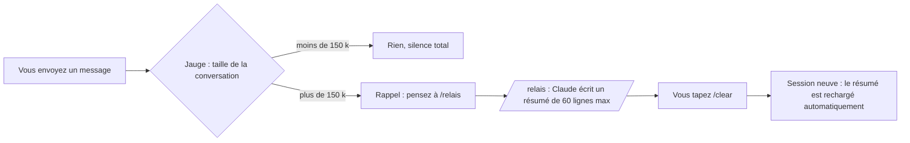

# relais — arrêter de payer la relecture de vos conversations Claude Code

*[English version](README.md)*

**relais** est un plugin pour Claude Code qui fait baisser fortement la consommation de tokens, sans
changer votre façon de travailler. Il surveille la taille de la conversation, vous prévient au bon
moment, fait écrire un résumé court de ce qui a été fait, puis relance une session légère qui repart
de ce résumé toute seule.

- Local : les scripts n'ouvrent aucune connexion réseau et n'envoient rien nulle part.
- Quelques petits scripts lisibles, aucune dépendance à installer.
- Messages en français ou en anglais (selon la langue du système).
- Testé sous Windows ; les scripts ont aussi des branches macOS et Linux (pas encore testées là-bas).

[](../../docs/relais.mp4)

*Vidéo d'une minute, avec musique : le problème, le relais, les économies mesurées, la délégation des longues tâches. Source : [video/](../../video/) (Remotion).*

---

## Sommaire

1. [Le problème : pourquoi Claude Code coûte si cher](#1-le-problème--pourquoi-claude-code-coûte-si-cher)
2. [Ce que fait relais](#2-ce-que-fait-relais)
3. [Ce que ça fait économiser](#3-ce-que-ça-fait-économiser)
4. [Installation](#4-installation)
5. [Utilisation au quotidien](#5-utilisation-au-quotidien)
6. [Le fichier de relais](#6-le-fichier-de-relais)
7. [Réglages](#7-réglages)
8. [Mesurer vos propres économies](#8-mesurer-vos-propres-économies)
9. [Confidentialité et sécurité](#9-confidentialité-et-sécurité)
10. [relais, /compact ou /clear ?](#10-relais-compact-ou-clear-)
11. [Dépannage](#11-dépannage)
12. [Limites](#12-limites)
13. [Tests et licence](#13-tests-et-licence)

---

## 1. Le problème : pourquoi Claude Code coûte si cher

Claude Code ne « se souvient » pas de la conversation : **à chaque action** (lire un fichier, lancer
une commande, éditer du code), il renvoie au modèle **toute** la conversation depuis le début. Le cache
rend cette relecture moins chère, mais elle reste facturée, et elle se répète des centaines de fois.

Un calcul simple :

| Taille de la conversation | Actions dans la journée | Tokens relus |
|---|---|---|
| 50 k | 300 | 15 millions |
| 500 k | 300 | **150 millions** |

Même travail, dix fois plus de tokens, uniquement parce que la conversation n'a jamais été
redémarrée. Avec les fenêtres de contexte d'un million de tokens, une conversation peut grossir
pendant des jours avant que Claude Code ne la résume de lui-même.

**Mesure réelle** (historique de l'auteur, 3 semaines, 103 sessions) :

- **97 %** des tokens consommés étaient de la **relecture d'historique** ;
- moins de 1 % était du texte réellement écrit par le modèle ;
- la plus grosse conversation relisait en moyenne **508 k tokens par action**, sur 10 016 actions.

On ne paie donc presque pas le travail produit : on paie surtout la relecture, encore et encore,
d'un historique géant.

---

## 2. Ce que fait relais



**1. La jauge** (à chaque message que vous envoyez)
Elle lit la fin du journal local de la conversation et mesure combien de tokens la dernière réponse a
dû relire. Sous 150 k : rien. Au-delà : un rappel à l'écran, et une courte note pour Claude, qui vous
proposera `/relais` au bon moment (à la fin d'une étape, pas au milieu). Un seul rappel par palier
(150 k, 250 k, puis tous les +100 k), jamais à chaque message. Elle ne lit que la fin du journal :
mesuré sur un journal de 505 Mo, 82 à 167 ms.

**2. La commande `/relais`**
Claude écrit un résumé de 60 lignes maximum dans le fichier propre à la session (`auto_<session>.md`,
chemin donné par le plugin) : objectif, où on en est, où lire quoi, vérifié / pas vérifié, décisions,
ce qui attend votre feu vert, prochaine étape exacte, pièges. Il n'écrit dans la mémoire du projet
qu'avec votre accord explicite dans la conversation (il propose, vous dites ok), **ajout seulement**. Il vous dit
ensuite de taper `/clear`. Quand le relais est (ré)écrit, un contrôle vérifie la longueur, les sections
obligatoires et les secrets possibles : Claude est prévenu **une fois**, pendant qu'il peut corriger.
En mode automatique, Claude n'a pas chargé le skill : la note de la jauge lui donne elle-même le format
exigé (1re ligne `# <sujet>`, les trois sections contrôlées, 60 lignes et 6 000 caractères au plus).

**3. La reprise automatique (v2 : par session)**
Après `/clear`, la nouvelle session ne considère **que le relais écrit par la session que vous venez de
fermer**. S'il est frais (écrit moins de 30 min avant le `/clear` et moins de 20k tokens de conversation
après lui), il est rechargé ; sinon (relais périmé, ou `/clear` longtemps après : probablement un
changement de sujet), il est seulement signalé, et « reprends le relais » le charge. Dans les deux cas,
une courte note de contrôles faits par du code l'accompagne : lignes supprimées dans la mémoire du
projet, secret possible, écart de fraîcheur et fichiers modifiés depuis (git), chemin cité introuvable,
propositions restées dans l'ancien `a-ranger.md`. Le tout tient en 8 000 caractères. Le relais n'est utilisé **qu'une fois** (puis archivé). Les relais des autres sessions
(onglet parallèle, ancien relais) sont seulement **signalés**, jamais chargés ni archivés : dites
« reprends le relais » pour en charger un. Un `/clear` dans une session sans relais ne charge rien.
Le bilan (section 5) ne s'affiche qu'après un vrai rechargement.

**4. La délégation des longues tâches (depuis la 2.1.0)**
Au début de chaque session (démarrage, `/clear`, compactage), Claude reçoit **une seule fois** une
consigne d'environ 60 tokens (234 caractères). Elle dit qu'une tâche longue (plus d'une dizaine de lectures ou d'étapes)
qui n'a pas besoin de l'historique part chez un sous-agent moins cher (Sonnet, ou Haiku pour un simple
relevé), avec une consigne autonome et un résultat court. Les tâches courtes, ce qui dépend de
l'historique, les questions et ce qui attend votre feu vert restent dans la conversation. Les fichiers
lus par le sous-agent n'entrent pas dans la conversation : elle reste légère pour la suite.

**5. Le registre : ce que Claude a appris (depuis la 2.2.0)**
Quand Claude résout un problème qui pourrait revenir, ou que tu poses une règle durable, il l'enregistre
en une commande : la règle à appliquer en une ligne, le problème, la solution, un sujet, et si elle vaut
partout ou pour ce projet. Le registre est un fichier sur le disque (`~/.claude/relais/registre.json`,
ou sous `$CLAUDE_CONFIG_DIR` si cette variable est définie) :
ni `/clear`, ni le compactage, ni une nouvelle session ne le perdent. À chaque début de session, les
entrées **actives** du dossier courant (celles du projet d'abord, puis les globales) sont redonnées à
Claude, en 4 500 caractères au plus ; au-delà, les entrées cachées sont comptées par sujet, avec la
commande qui les affiche. Plus rien de tout ça n'est recopié dans les relais. Dans le tableau (onglet
**Mémoire**), tu vois chaque entrée, tu l'actives ou la désactives (active par défaut), tu la modifies
ou la supprimes, et tu vois quels fichiers d'instructions Claude Code a réellement chargés.
- **Corriger plutôt que retenir** : un piège qu'un changement durable ferait disparaître (script, étape
  de build, ligne de config, test, hook) est marqué « à corriger », et la correction est proposée dans
  « En attente du feu vert » du relais au lieu d'être recopiée de relais en relais.
- **Pas de répétition, pas de faux « c'est déjà écrit »** : un hook `InstructionsLoaded` note quels
  `CLAUDE.md` Claude Code a vraiment chargés au début de la session. Après une demande de relais, les
  lignes du relais déjà dites par l'un de ces fichiers, ou par une entrée active du registre, sont
  signalées une fois, avec la ligne source ; Claude l'ouvre et ne retire la ligne que si la règle y est
  vraiment. Un fichier qui existe seulement (fiche de mémoire, `CLAUDE.md` d'un sous-dossier chargé
  seulement quand on y va, fichier global de l'autre PC) ne compte jamais, et un fichier modifié depuis
  est relu au moment du contrôle.
- Les secrets sont refusés (mots de passe, jetons, clés), et chaque entrée reste visible et modifiable.

---

## 3. Ce que ça fait économiser

Simulation sur les 5 plus grosses conversations réelles de l'auteur, avec un relais à chaque fois
que la conversation dépassait 150 k au moment d'un message (session neuve mesurée : ~41 k) :

| Conversation | Actions | Relu par action (moyenne) | Tokens relus : réel → avec relais | Économie |
|---|---|---|---|---|
| 1 | 28 308 | 521 k | 14 756 M → 3 307 M | **-78 %** |
| 2 | 10 016 | 508 k | 5 086 M → 1 066 M | **-79 %** |
| 3 | 4 667 | 507 k | 2 367 M → 1 170 M | -51 % |
| 4 | 1 035 | 408 k | 423 M → 107 M | -75 % |
| 5 | 724 | 556 k | 402 M → 73 M | -82 % |
| **Total** | | | **23 034 M → 5 723 M** | **-75 %** |

La conversation 3 gagne moins parce qu'elle contient de longues phases de travail autonome sans
message de l'utilisateur : le relais ne peut se faire qu'au moment où vous écrivez.

Ce que le plugin ajoute lui-même au contexte de Claude (mesuré en 2.3.0, en caractères ; tokens estimés
à ~3,5 caractères par token) :

| Moment | Ajout | En 2.2.0 |
|---|---|---|
| Début de session, registre vide | ~850 car. (~240 tokens) : délégation 234 + registre ~620 | ~1 280 car. |
| Début de session, registre typique (16 règles actives) | ~3 800 car. (~1 100 tokens) | ~4 650 car. |
| Passage d'un seuil (mode automatique) | ~760 car. (~220 tokens) | ~1 090 car. |
| `/relais` (note de la jauge + skill) | ~4 250 car. (~1 200 tokens) | ~5 830 car. |

**Délégation des longues tâches**, mesurée avec `claude -p` sur des copies identiques d'une même
session (Opus en session principale, prix API équivalents, détail dans
[docs/delegation.md](../../docs/delegation.md)) :

| Tâche | Sans la consigne | Avec la consigne | Conversation après |
|---|---|---|---|
| Lire 13 fichiers, session de 112 k | 1,57 $ | **1,25 à 1,32 $ (-16 à -20 %)** | 190 k → **132 k** |
| Revue de 26 fichiers, session de 112 k | 1,90 $ | **1,47 à 1,49 $ (-22 %)** | 215 k → **135 k** |
| Lire 13 fichiers, session de 35 k | 0,73 $ | **0,45 $ (-39 %)** | 97 k → **38 k** |
| Tâche de 1 à 5 appels | inchangé | inchangé : pas déléguée | |

La qualité était la même sur la tâche notée automatiquement (13 fichiers sur 13, noms exportés
exacts).

Mesurez vos propres chiffres avec le simulateur : [section 8](#8-mesurer-vos-propres-économies).

---

## 4. Installation

### Prérequis

- Claude Code avec la prise en charge des plugins (commande `/plugin`).
- **Node.js 18 ou plus récent** dans le PATH (`node --version`). Les hooks sont de petits scripts Node.

### Installation depuis GitHub (recommandée)

Dans Claude Code :

```
/plugin marketplace add nathangerardeaux/claude-relais
/plugin install relais@claude-relais
```

Ou depuis un terminal :

```
claude plugin marketplace add nathangerardeaux/claude-relais
claude plugin install relais@claude-relais
```

Puis **redémarrez Claude Code** (le plugin n'agit que dans les sessions ouvertes après
l'installation). Vérification :

```
claude plugin list
```

`relais` doit apparaître avec le statut chargé.

### Installation de secours (disque externe ou réseau)

Claude Code refuse d'installer un plugin situé sur un emplacement qu'il considère comme « réseau »
(par exemple un disque externe sous Windows) : erreur `network-shaped`. Dans ce cas, copiez le plugin
dans votre dossier personnel, où Claude Code le charge tout seul :

```
node <chemin-du-plugin>/scripts/installer.mjs
```

Il apparaîtra comme `relais@skills-dir`. Mise à jour : même commande avec `--update`.

**N'installez pas les deux à la fois** (marketplace ET secours) : les hooks s'exécuteraient deux fois.

### Désinstaller

- Installation GitHub : `/plugin uninstall relais@claude-relais`
- Installation de secours : supprimez le dossier `~/.claude/skills/relais/`

Vos relais écrits restent dans `~/.claude/relais/` : supprimez ce dossier si vous n'en voulez plus.
Si `CLAUDE_CONFIG_DIR` est défini, ces dossiers sont sous lui au lieu de `~/.claude` (comme pour le
tableau).

---

## 5. Utilisation au quotidien

Vous travaillez normalement. Tant que la conversation reste légère, relais ne dit rien.

**Quand la conversation dépasse 150 k** (puis 250 k, puis tous les +100 k), relais affiche un rappel
d'une ligne. Par défaut (mode automatique), Claude termine votre demande en cours, puis écrit ou
rafraîchit lui-même le relais de cette conversation (`auto_<session>.md`). **Vous tapez seulement
`/clear`**, quand ça vous arrange : la nouvelle session repart du relais. Claude ne tape jamais `/clear`
à votre place.

Avec `RELAIS_AUTO=0`, vous avez de simples rappels et vous passez le relais vous-même :

1. tapez `/relais` ;
2. Claude écrit le résumé et vous confirme : « Relais écrit : … Tapez /clear » ;
3. tapez `/clear` ;
4. la session repart avec le message « Relais repris : … », et Claude propose la prochaine étape.

**Le bilan (depuis la 1.3.0)** : à la reprise, relais rappelle combien l'ancienne conversation relisait,
puis, après la première réponse de la nouvelle session, affiche une seule fois :

> Bilan relais : avant 182k tokens relus à chaque action, maintenant 31k. Libérés : 151k par action (-83 %).

« Maintenant » est mesuré, pas estimé : c'est ce que la nouvelle session relit réellement (instructions
du système + relais + votre première demande).

**Le bon réflexe** : passer le relais **entre deux étapes** (une fonctionnalité finie, un bug corrigé,
un changement de sujet), pas au milieu d'une modification.

**Changer de sujet** : si vous passez à tout autre chose, un simple `/clear` suffit, sans relais.

---

## 6. Le fichier de relais

Emplacement : `~/.claude/relais/` (sous Windows : `%USERPROFILE%\.claude\relais\` ; sous
`$CLAUDE_CONFIG_DIR` s'il est défini), un fichier par session : `auto_<session>.md`. L'exemple
ci-dessous est au format v1 ; la v2 commence par `# <sujet>`, sans en-tête, et ajoute les sections que le
contrôle exige (titres en français ou en anglais) : **Vérifié / pas vérifié**, **En attente du feu
vert**, **Prochaine étape**, plus **Où lire quoi** (fichier et section exacts par sujet). Voir
`skills/relais/SKILL.md`.

```markdown
---
title: Menu mobile qui ne défile pas
cwd: /home/moi/projets/site
date: 2026-09-30 14:05
---

## Objectif
Que le menu du site défile sur téléphone au lieu de faire bouger la page derrière.

## Où on en est
- Fait : correctif CSS, vérifié sur 5 tailles d'écran.
- En cours : rien.

## Décisions prises
- Le sous-menu s'intègre au menu mobile dès 900 px (validé).

## Fichiers touchés
- `src/index.css` : hauteur bornée + défilement interne (commité, pas encore déployé)

## Prochaine étape
Construire le site puis le déployer.

## Pièges et points d'attention
- Le déploiement attend le feu vert.
```

- La v2 ne fait jamais confiance à ce que Claude écrit pour le dossier ou la session : les scripts
  notent eux-mêmes le vrai dossier, la session, l'heure, la taille du contexte et les HEAD git (projet
  et mémoire) dans `.etat/`. La ligne `cwd:` ne sert plus qu'aux relais au format v1, qui sont signalés
  (moins de 72 h après `/clear`, 12 h dans un nouvel onglet).
- Les connaissances durables vont dans le registre (section 2, point 5), plus dans `a-ranger.md` : celui
  des versions d'avant la 2.2.0 est seulement compté tant que vous ne l'avez pas vidé.
- Après usage, un relais est renommé en `.repris.md` : vous gardez l'historique de vos relais. Une fois
  par jour, le ménage supprime les `.repris.md` et `auto_*.md` de plus de 30 jours (jamais un relais
  récent, le registre ni `a-ranger.md`).
- C'est un fichier texte : vous pouvez le relire ou le corriger avant de taper `/clear`. Depuis la
  2.3.0, le relais corrigé est rechargé quand même (avec la taille et l'heure notées quand Claude l'a
  écrit).
- Titre affiché : la ligne `title:`, sinon le titre `# `, sinon le premier titre qui n'est pas une
  section du format, sinon la première ligne de texte.

---

## 7. Réglages

Depuis la 1.2.0, le relais est **automatique** : à chaque palier, Claude termine la demande en cours, puis écrit (ou met à jour) le relais lui-même, dans un seul fichier par conversation (`auto_<session>.md`). Tu n'as plus qu'à taper `/clear` quand tu veux. En mode automatique, Claude n'écrit dans aucun fichier de mémoire : les connaissances durables vont dans le registre (depuis la 2.2.0 ; le `a-ranger.md` des versions précédentes reste compté tant que tu ne l'as pas vidé).

Le dossier des relais suit `CLAUDE_CONFIG_DIR` s'il est défini (sinon `~/.claude`). Sept variables
d'environnement facultatives :

| Variable | Défaut | Rôle |
|---|---|---|
| `RELAIS_V2` | `1` | `0` = comportement v1 exact (interrupteur d'urgence, puis redémarrer Claude Code) |
| `RELAIS_AUTO` | `1` | `0` = retour aux simples rappels (tu tapes `/relais` toi-même) |
| `RELAIS_SEUIL_K` | `150` | Premier rappel, en milliers de tokens |
| `RELAIS_SEUIL_FORT_K` | `250` | Rappel insistant |
| `RELAIS_DELEGUER` | `1` | `0` = pas de consigne de délégation des longues tâches |
| `RELAIS_MEMOIRE` | `1` | `0` = les entrées du registre ne sont pas redonnées en début de session |
| `RELAIS_LANG` | selon le système | `fr` ou `en` |

Le plus simple est de les mettre dans le bloc `env` de `~/.claude/settings.json` :

```json
{
  "env": {
    "RELAIS_SEUIL_K": "120",
    "RELAIS_LANG": "fr"
  }
}
```

**Quel seuil choisir ?** Sur les conversations mesurées : 100 k = -83 %, 150 k = -79 %,
250 k = -71 %. Plus le seuil est bas, plus vous économisez, mais plus vous passez le relais souvent.
150 k est un bon équilibre.

---

## 8. Mesurer vos propres économies

Le simulateur rejoue vos vraies conversations passées (lecture seule, rien n'est modifié) :

```
node <chemin-du-plugin>/scripts/simuler-economie.mjs --top 5
```

Il trouve vos 5 conversations les plus lourdes dans `~/.claude/projects/`, mesure le coût de départ
d'une session neuve chez vous, et affiche l'économie qu'aurait donnée le relais. Pour une
conversation précise, avec un autre seuil :

```
node <chemin-du-plugin>/scripts/simuler-economie.mjs <journal.jsonl> 120
```

Pour voir votre consommation réelle en dollars : l'outil
[ccusage](https://github.com/ryoppippi/ccusage) (`npx ccusage@latest claude daily`).

---

## 9. Confidentialité et sécurité

- **Aucun accès réseau.** Aucun des scripts n'ouvre de connexion ni n'envoie quoi que ce soit.
- **Ce qui est lu** : la fin du journal de conversation que Claude Code tient déjà sur votre disque
  (`~/.claude/projects/…`, ou sous `$CLAUDE_CONFIG_DIR`), uniquement pour y lire le compteur de tokens de la dernière réponse ; et,
  en lecture seule avec un délai de 3 s, `git` dans le dossier du projet et dans son dossier de mémoire
  (HEAD, fichiers modifiés, lignes supprimées). Ces appels neutralisent toute option de configuration
  qui ferait exécuter un programme par un dépôt piégé (fsmonitor, filtres, diff externe, pager, hooks…)
  et ne font jamais convertir la copie de travail par git. Un dépôt dont le propriétaire n'est pas
  reconnu (disque exFAT, autre compte) n'est accepté, en ligne de commande seulement (`safe.directory`),
  que si le dossier ouvert EST la racine du dépôt : jamais un dépôt parent trouvé en remontant, une
  racine de disque ni le dossier temporaire. Les chemins cités dans un relais ne sont
  vérifiés que s'ils sont locaux (jamais `\\serveur\partage`, ni URL).
- **Ce qui est écrit** : les fichiers de relais dans `~/.claude/relais/` (effacés au bout de 30 jours),
  le registre, et de petits fichiers d'état dans `~/.claude/relais/.etat/` (effacés au bout de 7 jours ;
  ménage une fois par jour). Rien d'autre : le plugin **n'écrit
  jamais dans votre projet ni dans sa mémoire**, et n'annule jamais rien (ses contrôles avertissent).
- **Ce qui est ajouté au contexte de Claude** : au début de chaque session, la consigne de délégation
  (234 caractères) et les règles actives du registre (~620 caractères s'il est vide, 4 500 au plus) ;
  une note d'environ 760 caractères quand un seuil est franchi ; un relais avec ses contrôles (8 000
  caractères au plus) quand vous le reprenez. Détail : section 3.
- Un relais contient des informations sur votre projet (chemins, décisions). Il reste sur votre
  machine. Claude a pour consigne de n'y mettre **aucun secret** (mot de passe, jeton, clé), mais
  relisez-le si votre projet est sensible.
- En cas d'erreur, les hooks se taisent : ils ne bloquent **jamais** un message ni une session.
- Le code tient en quelques fichiers courts dans `scripts/` : lisez-les avant d'installer.

---

## 10. relais, /compact ou /clear ?

| | `/clear` seul | `/compact` | **relais** |
|---|---|---|---|
| Taille de départ ensuite | minimale | réduite, mais la conversation continue de grossir | minimale + résumé |
| Garde le fil du travail | non | oui, résumé automatique | oui, résumé structuré |
| Vous prévient au bon moment | non | non (automatique seulement près de la limite de la fenêtre) | **oui, dès 150 k** |
| Met à jour les notes durables | non | non | seulement avec votre accord explicite, ajout seulement |
| Trace lisible et corrigeable | non | non | oui, un fichier par relais |

`/compact` reste utile au milieu d'une tâche longue. relais sert surtout à **ne plus laisser une
conversation grossir sans s'en rendre compte**, ce qui est la vraie source de la facture.

---

## 11. Dépannage

**Je ne vois jamais de rappel.**
Vérifiez `claude plugin list` (relais chargé ?) et que la session a été ouverte **après**
l'installation. Tant que la conversation reste sous 150 k, c'est normal. Certaines interfaces
(extensions d'éditeur, applications tierces) n'affichent pas les messages de hook : Claude reçoit
quand même la note et vous proposera `/relais` lui-même.

**`node` introuvable.**
Installez Node.js 18+ et vérifiez que `node --version` fonctionne dans un nouveau terminal.

**Erreur `network-shaped` à l'installation.**
Le plugin est sur un disque externe ou réseau : utilisez l'installation de secours (section 4).

**Les rappels apparaissent en double.**
Le plugin est installé deux fois (marketplace et secours). Gardez-en un seul.

**Le relais n'est pas rechargé après /clear.**
La v2 ne recharge que `auto_<id de la session fermée>.md`. Vérifiez qu'il existe dans
`~/.claude/relais/` (ou sous `$CLAUDE_CONFIG_DIR` ; déjà servi : suffixe `.repris.md`). Les autres relais sont seulement signalés :
dites « reprends le relais ». Si deux sessions du même dossier font `/clear` à quelques secondes
d'écart, rien n'est chargé (ambigu), volontairement.

**Déboguer les hooks** : lancez `claude --debug`, ou `/debug` en cours de session.

---

## 12. Limites

- relais **ne vide jamais la conversation à votre place** : Claude écrit le relais, vous choisissez
  quand taper `/clear`. L'économie dépend de ce réflexe.
- Pendant une longue phase de travail autonome, sans message de votre part, la jauge ne se déclenche
  pas (elle agit quand vous écrivez).
- La qualité du résumé dépend du modèle. Le format imposé (60 lignes, prochaine étape exacte) limite
  les pertes, mais un détail peut manquer : relisez le relais pour les tâches critiques.
- Les économies de la section 3 sont des **simulations** sur un historique réel, pas une garantie.

---

## 13. Tests et licence

```
node scripts/tester.mjs
```

165 tests dans un dossier temporaire avec de faux dépôts git (jamais votre vrai `~/.claude`) : les 37
tests v1 (lancés avec `RELAIS_V2=0`), puis 89 tests v2 : reprise normale, deux sessions parallèles, `/clear`
de changement de sujet, course SessionEnd/SessionStart dans les deux ordres, relais sans en-tête et
titre, relais corrigé à la main avant `/clear`, trop long (contrôle Stop et budget de 8 000 caractères),
format donné par la note du mode automatique, relais périmé avec fichiers git listés, lignes supprimées
dans la mémoire, secret signalé sans masquage, chemin absent, dépôt git piégé, chemin UNC jamais sondé,
dépôt d'un autre propriétaire (`safe.directory` limité à la racine ouverte), `cd` en cours de session,
git lent, `CLAUDE_CONFIG_DIR`, dossier relais non inscriptible, ménage quotidien et purge à 30 jours,
`/relais` qui reçoit son fichier exact. La suite du registre (39 tests : enregistrement, secrets refusés,
note de début de session bornée, fichiers réellement chargés, lignes déjà dites) tourne à la fin, ou
seule : `node scripts/tester-registre.mjs`. `RELAIS_V2=0 node scripts/tester.mjs` lance la suite v1 et
celle du registre (76 tests), sans la suite v2.

Licence : GPL-3.0 ou version ultérieure (voir `LICENSE`). Copyright (C) 2026 nathangerardeaux.
