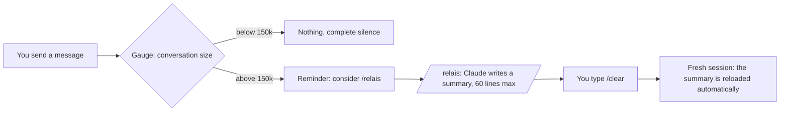

# relais — stop paying for Claude Code to re-read your conversations

*[Version française](README.fr.md)*

**relais** is a Claude Code plugin that sharply cuts token usage without changing how you work. It
watches the size of the conversation, warns you at the right moment, has Claude write a short
handoff of what was done, then starts a light session that picks up from that handoff by itself.

- Local: the scripts open no network connection and send nothing anywhere.
- A few small readable scripts, no dependency to install.
- Messages in English or French (follows the system language).
- Tested on Windows; the scripts also have macOS and Linux code paths (not tested there yet).

*"Relais" is French for "relay", as in a relay race: one session hands the baton to the next.*

[](../../docs/relais.mp4)

*One-minute video with music (in French): the problem, the relay, measured savings, delegating long tasks. Source: [video/](../../video/) (Remotion).*

---

## Contents

1. [The problem: why Claude Code gets so expensive](#1-the-problem-why-claude-code-gets-so-expensive)
2. [What relais does](#2-what-relais-does)
3. [How much it saves](#3-how-much-it-saves)
4. [Installation](#4-installation)
5. [Day-to-day use](#5-day-to-day-use)
6. [The relay file](#6-the-relay-file)
7. [Settings](#7-settings)
8. [Measure your own savings](#8-measure-your-own-savings)
9. [Privacy and security](#9-privacy-and-security)
10. [relais, /compact or /clear?](#10-relais-compact-or-clear)
11. [Troubleshooting](#11-troubleshooting)
12. [Limits](#12-limits)
13. [Tests and license](#13-tests-and-license)

---

## 1. The problem: why Claude Code gets so expensive

Claude Code does not "remember" the conversation: **on every action** (reading a file, running a
command, editing code) it sends the **whole** conversation from the start back to the model. Caching
makes that re-read cheaper, but it is still billed, and it happens hundreds of times.

A simple calculation:

| Conversation size | Actions in a day | Tokens re-read |
|---|---|---|
| 50k | 300 | 15 million |
| 500k | 300 | **150 million** |

Same work, ten times the tokens, only because the conversation was never restarted. With
one-million-token context windows, a conversation can keep growing for days before Claude Code
summarizes it on its own.

**Real measurement** (the author's own history, 3 weeks, 103 sessions):

- **97%** of the tokens consumed were **history re-reads**;
- less than 1% was text actually written by the model;
- the biggest conversation re-read **508k tokens per action** on average, over 10,016 actions.

You are barely paying for the work produced: you are mostly paying for re-reading a huge history,
again and again.

---

## 2. What relais does



**1. The gauge** (on every message you send)
It reads the end of the local conversation log and measures how many tokens the last response had to
re-read. Below 150k: nothing. Above: an on-screen reminder, plus a short note for Claude, which will
suggest `/relais` at the right time (at the end of a step, not in the middle). One reminder per
threshold (150k, 250k, then every +100k), never on every message. It only reads the end of the log:
measured on a 505 MB log, 82 to 167 ms.

**2. The `/relais` command**
Claude writes a summary of 60 lines max into this session's own file (`auto_<session>.md`, path given
by the plugin): goal, where things stand, where to read what, verified / not verified, decisions,
what waits for your go-ahead, the exact next step, pitfalls. It writes in the project's memory only if
you explicitly agree in the conversation (it suggests, you say ok), **additions only**. It then tells you to
type `/clear`. When the relay is (re)written, a check runs: too long, a required section missing or a
possible secret, and Claude is told **once** while it can still fix it. In auto mode Claude has not
loaded the skill: the gauge note itself gives the required format (first line `# <topic>`, the three
checked sections, 60 lines and 6,000 characters max).

**3. Automatic resume (v2: per session)**
After `/clear`, the new session only considers **the relay written by the session you just cleared**.
If it is fresh (written less than 30 min before `/clear` and less than 20k tokens of conversation after
it), it is reloaded; otherwise (stale relay, or `/clear` long after: most likely a change of topic) it is
only pointed to, and "resume the relay" loads it. Either way a short note of checks made by code comes
with it: lines deleted in the project memory, possible secret, freshness gap and files changed since
(git), cited path not found, items left in the old `a-ranger.md`. Everything fits in 8,000
characters. The relay is used **only
once** (then archived). Relays of other sessions (parallel tab, old relay) are only **announced**,
never loaded nor archived: say "resume the relay" to load one. A `/clear` in a session that wrote no
relay loads nothing. The tally (section 5) only shows after a real reload.

**4. Delegating long tasks (since 2.1.0)**
At the start of each session (startup, `/clear`, compaction), Claude gets a note of about 60 tokens (219 characters),
**once**. It says that a long task (more than about ten reads or steps) that does not need the history
goes to a cheaper subagent (Sonnet, or Haiku for a plain inventory), with a self-contained brief and a
short result. Short tasks, anything that depends on the history, questions and whatever awaits your
go-ahead stay in the conversation. The files read by the subagent never enter the conversation: it stays
light for what comes next.

**5. The registry: what Claude learned (since 2.2.0)**
When Claude solves a problem that could come back, or you set a lasting rule, it records it in one
command: a one-line rule to apply, the problem, the solution, a topic, and whether it is global or for
this project. The registry is a file on disk (`~/.claude/relais/registre.json`, or under
`$CLAUDE_CONFIG_DIR` when that variable is set): `/clear`, compaction
and new sessions never lose it. At every session start the **active** entries for the current folder
(project ones first, then global ones) are given back to Claude, within 4,500 characters; beyond that,
the hidden entries are counted per topic, with the command that shows them. Nothing of it is copied
into relays any more. In the dashboard (**Memory** tab) you see every entry, turn it off or on (on by
default), edit or delete it, and see which instruction files Claude Code really loaded.
- **Fix rather than remember**: a pitfall that a lasting change would remove (script, build step,
  config line, test, hook) is marked "to fix", and the fix is proposed in the relay's "Waiting for
  go-ahead" instead of being carried from relay to relay.
- **No repetition, no false "it is already written"**: an `InstructionsLoaded` hook records which
  `CLAUDE.md` files Claude Code really loaded at session start. After a relay request, relay lines
  already said by one of those files, or by an active registry entry, are flagged once, with the source
  line; Claude opens it and removes the line only if the rule is really there. A file that merely
  exists (a memory topic file, a nested `CLAUDE.md` loaded only when visiting its folder, the other
  computer's global file) never counts, and an edited file is re-read at check time.
- Secrets are refused (password, token, key patterns), and every entry stays visible and editable.

---

## 3. How much it saves

Simulation on the author's 5 biggest real conversations, relaying every time the conversation was
above 150k when a message was sent (measured fresh session: ~41k):

| Conversation | Actions | Re-read per action (average) | Re-read tokens: real → with relais | Saving |
|---|---|---|---|---|
| 1 | 28,308 | 521k | 14,756 M → 3,307 M | **-78%** |
| 2 | 10,016 | 508k | 5,086 M → 1,066 M | **-79%** |
| 3 | 4,667 | 507k | 2,367 M → 1,170 M | -51% |
| 4 | 1,035 | 408k | 423 M → 107 M | -75% |
| 5 | 724 | 556k | 402 M → 73 M | -82% |
| **Total** | | | **23,034 M → 5,723 M** | **-75%** |

Conversation 3 saves less because it contains long stretches of autonomous work with no message from
the user: a relay can only happen when you write.

What the plugin itself adds to Claude's context (measured on 2.3.0, in characters; tokens estimated at
~3.5 characters per token):

| When | Added | In 2.2.0 |
|---|---|---|
| Session start, empty registry | ~780 chars (~220 tokens): delegation 219 + registry ~560 | ~1,170 chars |
| Session start, typical registry (16 active rules) | ~3,750 chars (~1,070 tokens) | ~4,460 chars |
| Threshold crossed (auto mode) | ~730 chars (~210 tokens) | ~1,020 chars |
| `/relais` (gauge note + skill) | ~4,250 chars (~1,200 tokens) | ~5,810 chars |

**Delegating long tasks**, measured with `claude -p` on identical copies of one session (Opus as the
main model, API-equivalent prices, details in [docs/delegation.md](../../docs/delegation.md)):

| Task | Without the note | With the note | Conversation afterwards |
|---|---|---|---|
| Read 13 files, 112k session | $1.57 | **$1.25 to $1.32 (-16 to -20%)** | 190k → **132k** |
| Review 26 files, 112k session | $1.90 | **$1.47 to $1.49 (-22%)** | 215k → **135k** |
| Read 13 files, 35k session | $0.73 | **$0.45 (-39%)** | 97k → **38k** |
| Task of 1 to 5 calls | unchanged | unchanged: not delegated | |

Quality was the same on the automatically scored task (13 files out of 13, exact exported names).

Measure your own numbers with the simulator: [section 8](#8-measure-your-own-savings).

---

## 4. Installation

### Requirements

- Claude Code with plugin support (the `/plugin` command).
- **Node.js 18 or newer** on the PATH (`node --version`). The hooks are small Node scripts.

### Install from GitHub (recommended)

In Claude Code:

```
/plugin marketplace add nathangerardeaux/claude-relais
/plugin install relais@claude-relais
```

Or from a terminal:

```
claude plugin marketplace add nathangerardeaux/claude-relais
claude plugin install relais@claude-relais
```

Then **restart Claude Code** (the plugin only acts in sessions opened after installation). Check:

```
claude plugin list
```

`relais` should show up as loaded.

### Fallback install (external or network drive)

Claude Code refuses to install a plugin from a location it considers "network-shaped" (for example an
external drive on Windows). In that case, copy the plugin into your home folder, where Claude Code
loads it by itself:

```
node <plugin-path>/scripts/installer.mjs
```

It will show up as `relais@skills-dir`. To update: same command with `--update`.

**Do not install both** (marketplace AND fallback): the hooks would run twice.

### Uninstall

- GitHub install: `/plugin uninstall relais@claude-relais`
- Fallback install: delete the `~/.claude/skills/relais/` folder

Your written relays stay in `~/.claude/relais/`: delete that folder if you no longer want them.
If `CLAUDE_CONFIG_DIR` is set, these folders live under it instead of `~/.claude` (as for the
dashboard).

---

## 5. Day-to-day use

Work as usual. As long as the conversation stays light, relais says nothing.

**When the conversation goes above 150k** (then 250k, then every +100k), relais shows a one-line
reminder. By default (automatic mode), Claude finishes your current request, then writes or refreshes
the relay of this conversation by itself (`auto_<session>.md`). **You only type `/clear`**, whenever it
suits you: the new session picks up from the relay. Claude never types `/clear` for you.

With `RELAIS_AUTO=0` you get simple reminders instead, and you hand over yourself:

1. type `/relais`;
2. Claude writes the summary and confirms: "Relay written: … Type /clear";
3. type `/clear`;
4. the session restarts with "Relay resumed: …", and Claude suggests the next step.

**The tally (since 1.3.0)**: on resume, relais recalls how much the previous conversation re-read, then,
after the first answer of the new session, shows once:

> Relay tally: before 182k tokens re-read on every action, now 31k. Freed: 151k per action (-83%).

"Now" is measured, not estimated: it is what the new session really re-reads (system instructions +
relay + your first request).

**The right reflex**: hand over **between two steps** (a finished feature, a fixed bug, a change of
topic), not in the middle of an edit.

**Switching topics**: if you move on to something completely different, a plain `/clear` is enough,
no relay needed.

---

## 6. The relay file

Location: `~/.claude/relais/` (on Windows: `%USERPROFILE%\.claude\relais\`; under
`$CLAUDE_CONFIG_DIR` when set), one file per session: `auto_<session>.md`. The format below is the v1
one; v2 starts with `# <topic>`, no header, and adds three sections, the ones the check requires
(headings in French or English): **Verified / not verified**, **Waiting for go-ahead**, **Next step**,
plus **Where to read what** (exact file and section per subject). See `skills/relais/SKILL.md`.

```markdown
---
title: Mobile menu that does not scroll
cwd: /home/me/projects/site
date: 2026-09-30 14:05
---

## Goal
Make the site menu scroll on phones instead of moving the page behind it.

## Where we are
- Done: CSS fix, checked on 5 screen sizes.
- In progress: nothing.

## Decisions made
- The submenu joins the mobile menu from 900 px (validated).

## Files touched
- `src/index.css`: bounded height + inner scrolling (committed, not deployed yet)

## Next step
Build the site, then deploy it.

## Pitfalls and watch-outs
- Deployment waits for the go-ahead.
```

- v2 never trusts what Claude writes for the folder or the session: the scripts record the real
  folder, session, time, context size and git HEADs (project and memory) in `.etat/`. The `cwd:` line
  only serves v1-style relays, which are announced (less than 72 h after `/clear`, 12 h in a new tab).
- Durable knowledge goes to the registry (section 2, item 5), no longer to `a-ranger.md`: one left by
  a version before 2.2.0 is only counted until you empty it.
- After use a relay is renamed `.repris.md`: you keep a history of your relays. Once a day, the
  housekeeping deletes `.repris.md` and `auto_*.md` files older than 30 days (never a recent relay, the
  registry or `a-ranger.md`).
- It is a plain text file: you can read or correct it before typing `/clear`. Since 2.3.0 the corrected
  relay is still reloaded (with the size and time recorded when Claude wrote it).
- Title shown: the `title:` line, else the `# ` heading, else the first heading that is not a section
  of the format, else the first line of text.

---

## 7. Settings

Since 1.2.0 the relay is **automatic**: at each threshold, Claude finishes the current request, then writes (or refreshes) the relay itself in a single file per conversation (`auto_<session>.md`). You only type `/clear` whenever you want. In auto mode Claude writes no memory file: durable knowledge goes to the registry (since 2.2.0; `a-ranger.md` from older versions is still counted until you empty it).

The relais folder follows `CLAUDE_CONFIG_DIR` when it is set (else `~/.claude`). Seven optional
environment variables:

| Variable | Default | Purpose |
|---|---|---|
| `RELAIS_V2` | `1` | `0` = exact v1 behaviour (emergency switch, then restart Claude Code) |
| `RELAIS_AUTO` | `1` | `0` = back to simple reminders (you type `/relais` yourself) |
| `RELAIS_SEUIL_K` | `150` | First reminder, in thousands of tokens |
| `RELAIS_SEUIL_FORT_K` | `250` | Insistent reminder |
| `RELAIS_DELEGUER` | `1` | `0` = no note about delegating long tasks |
| `RELAIS_MEMOIRE` | `1` | `0` = registry entries are not given back at session start |
| `RELAIS_LANG` | from the system | `en` or `fr` |

The easiest place is the `env` block of `~/.claude/settings.json`:

```json
{
  "env": {
    "RELAIS_SEUIL_K": "120",
    "RELAIS_LANG": "en"
  }
}
```

**Which threshold?** On the measured conversations: 100k = -83%, 150k = -79%, 250k = -71%. The lower
the threshold, the more you save, but the more often you hand over. 150k is a good balance.

---

## 8. Measure your own savings

The simulator replays your real past conversations (read-only, nothing is modified):

```
node <plugin-path>/scripts/simuler-economie.mjs --top 5
```

It finds your 5 heaviest conversations in `~/.claude/projects/`, measures what a fresh session costs
you, and prints the saving the relay would have given. For one specific conversation, with another
threshold:

```
node <plugin-path>/scripts/simuler-economie.mjs <log.jsonl> 120
```

To see your real usage in dollars: [ccusage](https://github.com/ryoppippi/ccusage)
(`npx ccusage@latest claude daily`).

---

## 9. Privacy and security

- **No network access.** None of the scripts opens a connection or sends anything.
- **What is read**: the end of the conversation log Claude Code already keeps on your disk
  (`~/.claude/projects/…`, or under `$CLAUDE_CONFIG_DIR`), only to read the token counter of the last response; and, read-only with a
  3 s timeout, `git` in the project folder and in its memory folder (HEAD, changed files, deleted lines).
  These calls neutralise every configuration option a trapped repository could use to run a program
  (fsmonitor, filters, external diff, pager, hooks...) and never make git convert the working tree. A
  repository whose owner is not recognised (exFAT drive, other account) is accepted, on the command line
  only (`safe.directory`), only if the opened folder IS the top of the repository: never a parent
  repository found by walking up, a drive root or the temp folder. Paths
  cited in a relay are only checked if they are local (never `\\server\share`, nor URLs).
- **What is written**: relay files in `~/.claude/relais/` (deleted after 30 days), the registry, and
  tiny state files in `~/.claude/relais/.etat/` (deleted after 7 days; housekeeping once a day). Nothing else: the plugin **never writes in your
  project nor in its memory**, and never undoes anything (its checks only warn).
- **What is added to Claude's context**: at every session start, the delegation note (219 characters)
  and the active registry rules (~560 characters when empty, 4,500 at most); a note of about 730
  characters when a threshold is crossed; a relay with its checks (8,000 characters at most) when you
  resume it. Details: section 3.
- A relay contains information about your project (paths, decisions). It stays on your machine.
  Claude is instructed to put **no secrets** in it (password, token, key), but re-read it if your
  project is sensitive.
- On any error, the hooks stay silent: they **never** block a message or a session.
- The code is a few short files in `scripts/`: read them before installing.

---

## 10. relais, /compact or /clear?

| | `/clear` alone | `/compact` | **relais** |
|---|---|---|---|
| Starting size afterwards | minimal | reduced, but the conversation keeps growing | minimal + summary |
| Keeps the thread of the work | no | yes, automatic summary | yes, structured summary |
| Warns you at the right time | no | no (automatic only near the window limit) | **yes, from 150k** |
| Updates durable notes | no | no | only with your explicit agreement, additions only |
| Readable, editable trace | no | no | yes, one file per relay |

`/compact` is still useful in the middle of a long task. relais is mostly about **never letting a
conversation grow unnoticed again**, which is where the bill really comes from.

---

## 11. Troubleshooting

**I never see a reminder.**
Check `claude plugin list` (relais loaded?) and that the session was opened **after** installing.
While the conversation stays under 150k, silence is normal. Some interfaces (editor extensions,
third-party apps) do not display hook messages: Claude still receives the note and will suggest
`/relais` itself.

**`node` not found.**
Install Node.js 18+ and check that `node --version` works in a new terminal.

**`network-shaped` error when installing.**
The plugin sits on an external or network drive: use the fallback install (section 4).

**Reminders show up twice.**
The plugin is installed twice (marketplace and fallback). Keep only one.

**The relay is not reloaded after /clear.**
v2 reloads only `auto_<id of the cleared session>.md`. Check that it exists in `~/.claude/relais/`
(or under `$CLAUDE_CONFIG_DIR`; already used: `.repris.md` suffix). Other relays are only announced: say "resume the relay". If two
sessions of the same folder are cleared within a few seconds, nothing is loaded (ambiguous), on purpose.

**Debugging the hooks**: run `claude --debug`, or `/debug` during a session.

---

## 12. Limits

- relais **never clears the conversation for you**: Claude writes the relay, you decide when to type
  `/clear`. The saving depends on that reflex.
- During a long autonomous run with no message from you, the gauge does not fire (it acts when you
  write).
- Summary quality depends on the model. The imposed format (60 lines, exact next step) limits losses,
  but a detail can slip: re-read the relay for critical tasks.
- The savings in section 3 are **simulations** on a real history, not a guarantee.

---

## 13. Tests and license

```
node scripts/tester.mjs
```

165 tests in a temporary folder with throw-away git repositories (never your real `~/.claude`): the 37
v1 tests (run with `RELAIS_V2=0`), then 89 v2 tests: normal resume, two parallel sessions, `/clear` to
change topic, SessionEnd/SessionStart race in both orders, relay without header and its title, relay
corrected by hand before `/clear`, too long (Stop check and 8,000-character budget), format given by the
auto-mode note, stale relay with git file list, deleted memory lines, secret without masking, missing
path, trapped git repository, UNC path never probed, repository of another owner (`safe.directory`
limited to the opened top folder), `cd` during the session, slow git, `CLAUDE_CONFIG_DIR`, unwritable
relais folder, daily housekeeping and 30-day purge, `/relais` gets its exact file. The registry suite
(39 tests: recording, secrets refused, bounded session-start note, files really loaded, lines already
said) runs at the end, or alone: `node scripts/tester-registre.mjs`. `RELAIS_V2=0 node scripts/tester.mjs`
runs the v1 and registry suites (76 tests), without the v2 suite.

License: GPL-3.0-or-later (see `LICENSE`). Copyright (C) 2026 nathangerardeaux.
